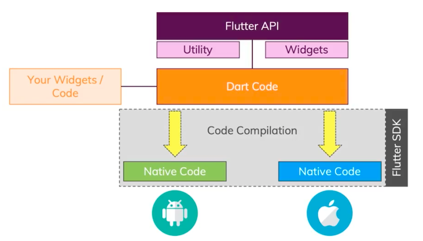

# About Flutter

This document will cover the basic concepts of Flutter and its architecture.

## Table of Contents

- [What is Flutter?](#what-is-flutter)
  - [Dart](#dart)
  - [Flutter Framework](#flutter-framework)
  - [Flutter SDK](#flutter-sdk)
- [Flutter architectural overview](#flutter-architectural-overview)
  - [Framework (Dart)](#framework-dart)
    - [Foundation](#foundation)
    - [Animation, Painting, Gestures](#animation-painting-gestures)
    - [Rendering](#rendering)
    - [Widgets](#widgets)
    - [Material & Cupertino](#material--cupertino)
  - [Engine (C/C++)](#engine-cc)
    - [Service Protocol](#service-protocol)
    - [Composition](#composition)
    - [Platform Channels](#platform-channels)
    - [Dart Isolate Setup](#dart-isolate-setup)
    - [Rendering](#rendering-1)
  - [Embedder (Platform-specific)](#embedder-platform-specific)
    - [Render Surface Setup](#render-surface-setup)
    - [Native Plugins](#native-plugins)
    - [App Packaging](#app-packaging)
    - [Thread Setup](#thread-setup)
    - [Event Loop Interop](#event-loop-interop)
- [Flutter execution flow](#flutter-execution-flow)
  - [Flutter API](#flutter-api)
  - [Your Widgets / Code](#your-widgets--code)
  - [Dart Code](#dart-code)
  - [Code Compilation (Flutter SDK)](#code-compilation-flutter-sdk)
  - [Native Code (Android & iOS)](#native-code-android--ios)

## What is Flutter?

Flutter is a complete SDK (Software Development Kit) for building natively compiled applications for mobile, web, and desktop from a single codebase.

```
┌───────────────────────────────┐
│          Flutter SDK          │
│                               │
│  ┌─────────────────────────┐  │
│  │    Dev & Build Tools    │  │
│  │   (flutter CLI, etc.)   │  │
│  └─────────────────────────┘  │
│                               │
│  ┌─────────────────────────┐  │
│  │    Flutter Framework    │  │
│  │  (Widgets, UI, Anim.)   │  │
│  │     Written in Dart     │  │
│  └─────────────────────────┘  │
│                               │
│  ┌─────────────────────────┐  │
│  │        Dart SDK         │  │
│  │   (Compiler, Runtime)   │  │
│  └─────────────────────────┘  │
└───────────────────────────────┘
```

### Dart

- **Dart is the programming language**.
- You write your app’s logic, variables, functions, and classes in Dart.
- Flutter apps are written _using Dart_.

### Flutter Framework

- This is **a framework built using Dart**.
- It provides:
  - Navigation
  - Animations
  - State management helpers
  - UI components (**widgets** like buttons, text, layouts)
- It tells Flutter _how_ to build and render your app UI.

### Flutter SDK

- The SDK is **a set of tools** that helps you develop, test, and run Flutter apps.
- It includes:
  - Dart SDK
  - The Flutter Framework
  - Command-line tools (`flutter run`, `flutter build`)
  - Debugging and compilation tools

---

How they all fit together

- You **write code in Dart**
- Using the **Flutter Framework**
- Powered and managed by the **Flutter SDK**

---

Analogy (Building a House)

1. **Dart** -> The language you use to give instructions to workers (English, Spanish, etc.)
2. **Flutter Framework** -> The architectural design + building materials (walls, doors, windows, blueprints)
3. **Flutter SDK** -> The toolbox and machinery (hammer, crane, measuring tools, power tools)

Why we need all of them?

- Without the language, you can’t communicate.
- Without the framework, you don’t know what to build.
- Without the SDK, you can’t actually construct.

## Flutter architectural overview


source: https://docs.flutter.dev/resources/architectural-overview

### Framework (Dart)

This entire top section is **written in Dart** and is what **Flutter developers interact with directly**.

#### Foundation

- Lowest layer of the framework
- Basic utilities: logging, collections, async, services
- No UI yet - just core building blocks

#### Animation, Painting, Gestures

These are the core UI capabilities:

- **Animation**: Tweens, controllers, curves
- **Painting**: Drawing shapes, text, images
- **Gestures**: Taps, swipes, drags, multitouch

They don’t create UI by themselves - they **support widgets**.

#### Rendering

- Converts widgets into a **render tree**
- Handles layout (size & position)
- Knows _how_ things should appear on screen

#### Widgets

- Everything in Flutter is a **widget**
- Buttons, text, padding, layouts - all widgets
- Widgets are **immutable descriptions** of the UI

#### Material & Cupertino

- Ready-made design systems:
  - **Material** -> Android / Google design
  - **Cupertino** -> iOS-style UI

- Built on top of widgets (not special or native)

---

📌 **Key idea**:

> Widgets describe UI -> Rendering lays it out -> Painting draws it

### Engine (C/C++)

This layer is **written in C/C++** and runs close to the system.

#### Service Protocol

Enables debugging, profiling, hot reload, and tooling communication with the Dart VM

#### Composition

Composes multiple visual layers into a final scene before rendering

#### Platform Channels

Dart <-> native communication

#### Dart Isolate Setup

Concurrency model

#### Rendering

Renders pixels using Skia (and Impeller on supported platforms)

- **System Events**: Touch, keyboard, lifecycle
- **Dart Runtime Mgmt**: Manages execution of Dart code
- **Frame Scheduling**: Coordinates when frames are produced in sync with the display refresh rate
- **Asset Resolution**: Images, fonts, resources
- **Frame Pipelining**: Splits UI, layout, and rendering work across threads for smooth performance
- **Text Layout**: Fonts, shaping, glyphs

---

📌 This is why Flutter is fast:

> It **does not use native UI components** - it draws everything itself.

### Embedder (Platform-specific)

This layer is **different for each platform**:

- Android
- iOS
- Windows
- macOS
- Linux
- Web (special case)

#### Render Surface Setup

Sets up the platform’s graphics surface (OpenGL / Vulkan / Metal) for drawing.

#### Native Plugins

Provides access to platform APIs via Dart–native plugins.

#### App Packaging

Bundles Flutter code and assets into platform-specific app formats.

#### Thread Setup

Initializes threads needed by the Flutter engine.

#### Event Loop Interop

Connects Flutter’s event loop with the platform’s message loop.

---

📌 Think of the embedder as:

> “How Flutter plugs into this OS”

---

How a tap becomes pixels (end-to-end flow)

1. User taps the screen (OS)
2. **Embedder** receives the event
3. Event goes to **Engine**
4. Engine forwards it to **Framework (Dart)**
5. Widgets update state
6. Rendering & Painting happen
7. Engine draws pixels
8. Embedder shows them on screen

All in ~16ms ⚡

---

One-sentence summary

> **Framework (Dart)** defines _what the UI is_,
> **Engine (C/C++)** figures out _how to draw it_,
> **Embedder** connects Flutter to _each platform_.

## Flutter execution flow



source: https://academind.com/

### Flutter API

- Provides:
  - **Widgets** (UI building blocks)
  - **Utility** classes (layout, animation, gestures, etc.)
- This is the **Flutter Framework layer**

### Your Widgets / Code

- This is **your app code**, written in **Dart**
- You use Flutter’s APIs (widgets + utilities)

### Dart Code

- Your code + Flutter framework code
- Written entirely in **Dart**
- Platform-independent (same code for Android & iOS)

### Code Compilation (Flutter SDK)

- Dart code is **compiled ahead-of-time (AOT)** for release
- Converted into **native machine code**
  - Android -> ARM / native binaries
  - iOS -> ARM / native binaries

📌 No Java/Kotlin or Swift/Objective-C UI code is generated.

### Native Code (Android & iOS)

- Platform-specific binaries run directly on the device
- Flutter’s engine handles rendering, input, and performance

---

📌 **Key idea**

> Flutter **does not translate Dart into native UI widgets**.
> It compiles Dart into **native code** and **draws its own UI**.

---

One-line summary

**Widgets -> Dart code -> Native machine code -> Runs directly on Android & iOS**
