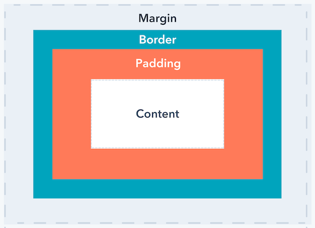
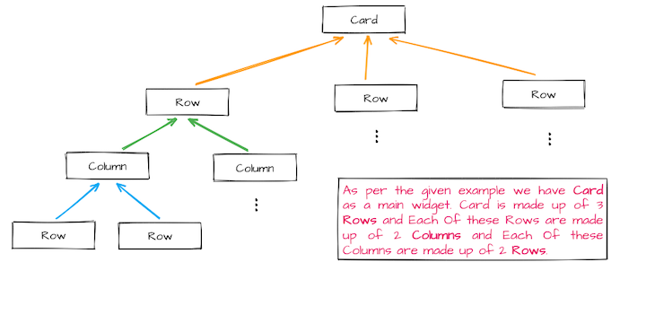

# Widgets

In Flutter, "everything is a widget." From a simple piece of text to a complex layout, widgets are the fundamental building blocks used to construct your application's user interface.

## Core Widgets

These are the most commonly used widgets that handle everything from the app's root structure to displaying simple content.

| Widget            | Purpose                                                                               | Key Property        |
| :---------------- | :------------------------------------------------------------------------------------ | :------------------ |
| **`MaterialApp`** | The root of your app. Configures navigation, themes, and Material Design.             | `home` or `routes`  |
| **`Scaffold`**    | Implements the basic Material Design layout structure (AppBar, Body, FloatingButton). | `appBar`, `body`    |
| **`Text`**        | Displays a string of text with a specific style.                                      | `style` (TextStyle) |
| **`Image`**       | Renders an image from a provider (Asset, Network, File).                              | `image`             |
| **`Icon`**        | Displays a graphical symbol from a font.                                              | `icon`              |
| **`Container`**   | A versatile widget that combines painting, positioning, and sizing.                   | `decoration`        |

> [!IMPORTANT]
> A `Scaffold` should generally be used only once per page to provide the structural frame.

## Layout & Positioning

Layout widgets allow you to arrange multiple children horizontally, vertically, or on top of each other.

### 1. Rows and Columns

The most powerful layout widgets. Use `Row` for horizontal alignment and `Column` for vertical.

- **`MainAxisAlignment`**: Controls how children are aligned along the primary axis (horizontal for `Row`, vertical for `Column`).
- **`CrossAxisAlignment`**: Controls alignment along the perpendicular axis.

**Example**

```dart
Column(
  mainAxisAlignment: MainAxisAlignment.center, // Center vertically
  crossAxisAlignment: CrossAxisAlignment.stretch, // Stretch horizontally
  children: [ ... ],
)
```

### 2. Stack

Allows you to overlay widgets on top of each other along the Z-axis. Perfect for overlapping text on images or adding badges. Use the **`Positioned`** widget inside a `Stack` for precise control over a child's location relative to the stack's edges.

**Example**

```dart
Stack(
  children: [
    const Icon(Icons.mail, size: 48),
    Positioned(
      top: 0,
      right: 0,
      child: Container(
        padding: const EdgeInsets.all(4),
        decoration: const BoxDecoration(color: Colors.red, shape: BoxShape.circle),
        child: const Text('1', style: TextStyle(fontSize: 12, color: Colors.white)),
      ),
    ),
  ],
)
```

### 3. Scrollable Lists

- **`ListView`**: Displays children in a scrollable list. For long or infinite lists, use **`ListView.builder`** to lazily load items as they scroll into view, significantly improving performance.
- **`GridView`**: Arranges children in a 2D scrollable grid.
- **`Key`**: We should assign a unique key to each item in the list/grid. This helps Flutter identify which widgets have changed, providing better performance and maintaining state when the list/grid changes.

**Example**

```dart
ListView.builder(
  itemCount: users.length,
  itemBuilder: (context, index) {
    return ListTile(
      key: ValueKey(users[index].id), // Helps Flutter track this specific item
      title: Text(users[index].name),
    );
  },
)
```

## Interactions

Capture user input and touch events using these specialized widgets:

- **Buttons**: `TextButton`, `ElevatedButton`, and `IconButton` provide standardized Material Design interaction styles.
- **`TextField`**: Enables users to enter text via a soft keyboard. Controlled via a `TextEditingController`.
- **`GestureDetector`**: Wraps any widget to detect taps, double-taps, drags, and more.
- **`InkWell`**: Similar to `GestureDetector` but adds a professional Material "ripple" visual effect on tap.

## Styling & Decoration

By applying styles and decoration to widgets, we can make our widgets look and feel like it belongs in the app.

### The Box Model

Understanding how widgets occupy space is crucial for building beautiful UIs.

<p align="center">
  
</p>

1.  **Content**: The actual widget (Text, Image, etc.).
2.  **Padding**: Space inside the border, surrounding the content.
3.  **Border**: The boundary around the padding and content.
4.  **Margin**: Transparent space outside the border that separates the widget from others.

### Working with `Container` & `BoxDecoration`

The `Container` widget is often used as a wrapper for styling. Use `BoxDecoration` for advanced visual effects:

```dart
Container(
  margin: const EdgeInsets.all(16.0),
  decoration: BoxDecoration(
    color: Colors.white,
    borderRadius: BorderRadius.circular(12.0),
    border: Border.all(color: Colors.blueAccent, width: 2),
    gradient: const LinearGradient(
      colors: [Colors.blue, Colors.lightBlueAccent],
      begin: Alignment.topLeft,
      end: Alignment.bottomRight,
    ),
    boxShadow: [
      BoxShadow(color: Colors.black12, blurRadius: 10, offset: Offset(0, 4)),
    ],
  ),
  child: const Padding(
    padding: EdgeInsets.all(20.0),
    child: Text("Premium Decoration"),
  ),
);
```

### Colors in Depth

Flutter provides several ways to define colors:

- **`Colors.blue`**: Predefined Material color palette.
- **`Color(0xFF42A5F5)`**: Hexadecimal (8 digits: Alpha, Red, Green, Blue).
- **`Color.fromARGB(255, 66, 165, 245)`**: Alpha (0-255), then RGB.
- **`Color.fromRGBO(66, 165, 245, 1.0)`**: RGB, then Opacity (0.0-1.0).

### Alignment

Use the `Alignment` property or the `Center` widget to position children within their parents.

- `Alignment(-1.0, -1.0)` is top-left.
- `Alignment(0.0, 0.0)` is center.
- `Alignment(1.0, 1.0)` is bottom-right.

## Building Professional UIs

When building a new screen, follow this workflow:

### 1. Breakdown the Design

Visually decompose the design into smaller pieces. Identify the structural widgets (Row, Column, Stack).

### 2. Build the Widget Tree

Map your breakdown to a nested structure.

<p align="center">
  
</p>

### 3. Refine with State

Understand the difference between **`StatelessWidget`** (static UI) and **`StatefulWidget`** (dynamic UI that changes with data).

> [!TIP]
> Keep your widgets small and modular. If a part of your widget tree becomes too deeply nested, extract it into a separate widget class for better readability and performance.

## The "Expenses App"

The `expenses` folder contains a complete project that puts all the concepts from this module into practice — from widget composition and styling to stateful UI and custom data models.

### What you'll learn from it:

- **`StatefulWidget` & `setState`**: The home page (`MyHomePage`) manages a live list of transactions. Adding or deleting an item calls `setState`, triggering a UI rebuild.
- **Custom Data Models**: The `Transaction` class (in `lib/models/`) is an `@immutable` data model with `id`, `title`, `amount`, and `date` fields — a clean way to structure app data.
- **Custom Widgets & Decomposition**: The UI is broken into focused, reusable widgets:
  - **`Chart`**: Displays a 7-day spending bar chart by grouping transactions per day.
  - **`ChartBar`**: A single bar in the chart, driven by a percentage of total weekly spending.
  - **`TransactionList`**: A scrollable list of all transactions with a delete option.
  - **`NewTransaction`**: A modal bottom sheet form for adding a new transaction.
- **App-Level Theming**: `main.dart` uses `ThemeData` with a `ColorScheme` and custom `textTheme` to apply consistent styles across the whole app.

### How to Run:

1. Change directory to `expenses`.
2. Run `flutter pub get` to fetch dependencies.
3. Run `flutter run` to launch it on your connected device or emulator.
