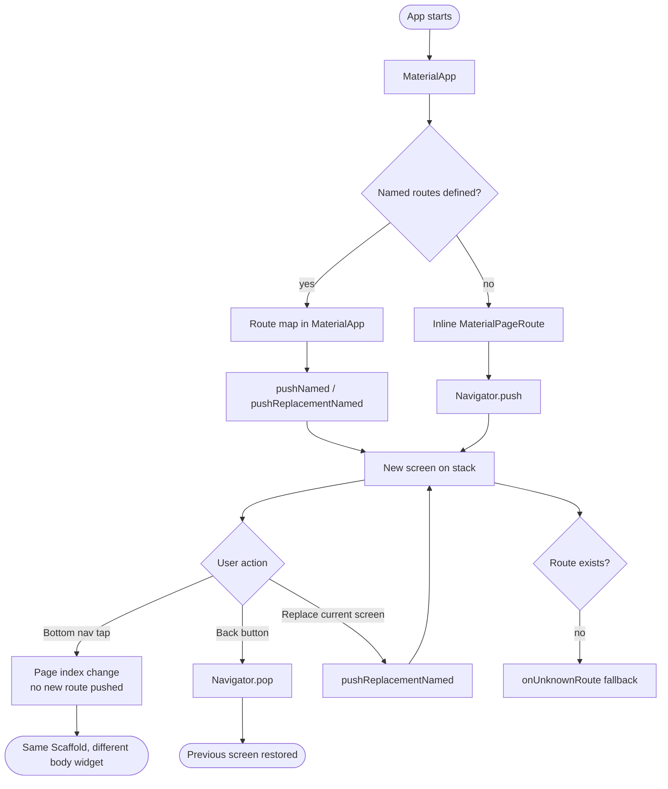

# Navigation

Everything in Flutter is a widget; including navigation. Multi-screen apps are built using container widgets like `MaterialApp` that manage a **stack of routes** and display different screens based on user actions.

**What is Stack**

Stack is a linear data structure that follows **LIFO** - Last In, First Out. The last element added is the first one removed, like a stack of plates: you always add and remove from the top.

Two core operations:

- **push** - add an element to the top
- **pop** - remove the element from the top

```
push(A)   ->  [ A ]
push(B)   ->  [ A | B ]
push(C)   ->  [ A | B | C ]
pop()     ->  [ A | B ]        returns C
pop()     ->  [ A ]            returns B
```

Stacks are used wherever you need to track history or reverse a sequence — undo/redo, browser back navigation, function call chains, and expression parsing are all classic examples.

## Navigation basics

Flutter's navigation system is built on a stack; push a new screen to navigate forward, pop it to go back, just like a stack of plates.

### Pushing new screens

| Method                  | What it does                                                                         |
| :---------------------- | :----------------------------------------------------------------------------------- |
| `Navigator.push()`      | Adds a new route on top of the stack. The user can go back with the back button.     |
| `Navigator.pushNamed()` | Same as `push`, but uses a route name (string) instead of building the route inline. |

### Replacing the current screen

| Method                             | What it does                                                                                    |
| :--------------------------------- | :---------------------------------------------------------------------------------------------- |
| `Navigator.pushReplacement()`      | Replaces the current route with a new one. The user cannot go back to the replaced screen.      |
| `Navigator.pushReplacementNamed()` | Same as `pushReplacement`, but uses a route name (string) instead of building the route inline. |

### Pushing and clearing the stack

| Method                                | What it does                                                                                                                       |
| :------------------------------------ | :--------------------------------------------------------------------------------------------------------------------------------- |
| `Navigator.pushAndRemoveUntil()`      | Pushes a new route and removes all routes below it until the predicate returns true. Useful for "go to home and clear everything". |
| `Navigator.pushNamedAndRemoveUntil()` | Same as `pushAndRemoveUntil`, but uses a route name.                                                                               |

### Going back

| Method                 | What it does                                                                                             |
| :--------------------- | :------------------------------------------------------------------------------------------------------- |
| `Navigator.pop()`      | Removes the current route, returning to the previous screen.                                             |
| `Navigator.popUntil()` | Pops routes repeatedly until the predicate returns true. Useful for going back multiple screens at once. |
| `Navigator.maybePop()` | Pops the route if possible, otherwise does nothing. Safer alternative to `pop()`.                        |

### Inspecting the stack

| Method               | What it does                                                                                         |
| :------------------- | :--------------------------------------------------------------------------------------------------- |
| `Navigator.canPop()` | Returns `true` if there is more than one route on the stack — i.e. there is something to go back to. |

## How the navigation stack works



## MaterialPageRoute

`MaterialPageRoute` is the standard way to navigate to a new screen without named routes. You build the route inline, directly passing the destination widget.

```dart
Navigator.push(
  context,
  MaterialPageRoute(
    builder: (ctx) => MealDetailScreen(meal: meal),
  ),
);
```

It applies a platform-appropriate transition; slide on Android, fade on iOS; and automatically wires up the back button.

The downside is that routes defined inline are scattered across the codebase, making it harder to see all your app's screens at a glance.

## Named routes

Instead of building routes inline with `MaterialPageRoute`, define all routes in a central map on `MaterialApp`. This keeps navigation organised and makes it easy to see every screen at a glance.

```dart
MaterialApp(
  home: HomeScreen(favouriteMeals: _favouriteMeals),
  routes: {
    '/category-meals': (ctx) => MealsInCategoryScreen(availableMeals: _availableMeals),
    '/meal-details': (ctx) => MealDetailScreen(
      onToggleFavourite: _toggleFavourite,
      isMealFav: _isMealFav,
    ),
    '/filters': (ctx) => FiltersScreen(
      currentFilters: _filters,
      setFiltersHandler: _setFilters,
    ),
  },
)
```

Define route names as static constants on each screen class to avoid typos:

```dart
class MealDetailScreen extends StatelessWidget {
  static const routeName = '/meal-details';
  // ...
}

// Navigate to it:
Navigator.of(context).pushNamed(MealDetailScreen.routeName, arguments: meal.id);
```

## Passing arguments between screens

Most real-world navigation involves sending data to the destination screen. Flutter handles this through the `arguments` parameter on `pushNamed`; you can pass any object.

> **Note:** You will notice that we access args in the `build` method. To understand why this is necessary and how to safely access arguments earlier in the lifecycle, check out [Reading Route Arguments Early](complex_navigation_concepts.md#reading-route-arguments-early) in the complex navigation guide.

### Passing a map (e.g. category ID and title)

```dart
Navigator.of(context).pushNamed(
  MealsInCategoryScreen.routeName,
  arguments: {'id': id, 'title': title},
);
```

Reading it on the other side:

```dart
@override
Widget build(BuildContext context) {
  final args = ModalRoute.of(context)?.settings.arguments as Map<String, String>;
  final categoryID = args['id'];
  final categoryTitle = args['title'];
}
```

### Passing a simple value (e.g. a meal ID string)

```dart
Navigator.of(context).pushNamed(MealDetailScreen.routeName, arguments: meal.id);

// Reading it:
final mealID = ModalRoute.of(context)?.settings.arguments as String;
```

> **Tip:** Use `?.settings.arguments` (with `?`) when arguments might be null.

## Unknown routes

If a user somehow navigates to a route that doesn't exist, `onUnknownRoute` acts as a fallback; similar to a 404 page on the web.

```dart
MaterialApp(
  // ...
  onUnknownRoute: (settings) {
    return MaterialPageRoute(
      builder: (ctx) => HomeScreen(favouriteMeals: _favouriteMeals),
    );
  },
)
```

## Drawer

A `Drawer` is a sliding side menu that provides secondary navigation; links to settings, filters, or other sections that don't belong in the main tab bar.

```dart
Scaffold(
  appBar: _buildAppBar(context),
  drawer: const MainDrawer(),   // slides in from the left
  body: _pages[_selectedPageIndex].page,
)
```

Inside the drawer, use `pushReplacementNamed` instead of `pushNamed` to avoid stacking screens:

```dart
ListTile(
  leading: Icon(Icons.rule),
  title: Text('Filters'),
  onTap: () => Navigator.of(context).pushReplacementNamed(FiltersScreen.routeName),
)
```

> **Important:** Use `pushReplacementNamed` for drawer navigation. Using `pushNamed` adds a new screen to the stack on every tap, so the user has to press back through all of them.

## Bottom navigation bar

Bottom navigation provides quick switching between top-level views. Each tab shows a different page without pushing a new route; it's all managed by **State** within a single `StatefulWidget`.

The pattern has four steps:

1. Define your pages as a list
2. Track the selected index in state
3. Show the page at the current index in `Scaffold`'s body
4. Update the index on tap

```dart
class _HomeScreenState extends State<HomeScreen> {
  int _selectedPageIndex = 0;
  late final List<_PageData> _pages;

  @override
  void initState() {
    super.initState();
    _pages = [
      const _PageData(
        title: 'Categories',
        icon: Icons.dashboard,
        page: CategoriesGridView(),
      ),
      _PageData(
        title: 'Favorites',
        icon: Icons.favorite,
        page: FavouriteListView(favouriteMeals: widget.favouriteMeals),
      ),
    ];
  }

  void _selectPage(int index) {
    setState(() {
      _selectedPageIndex = index;
    });
  }

  @override
  Widget build(BuildContext context) {
    return Scaffold(
      bottomNavigationBar: BottomNavigationBar(
        onTap: _selectPage,
        currentIndex: _selectedPageIndex,
        items: List.generate(
          _pages.length,
          (index) => BottomNavigationBarItem(
            icon: Icon(_pages[index].icon),
            label: _pages[index].title,
          ),
        ),
      ),
      body: _pages[_selectedPageIndex].page,
    );
  }
}
```

> **Tip:** You can use Flutter's built-in `BottomNavigationBar` widget for standard Material styling, or build a fully custom one with `Row` and `InkWell`; the state management pattern is the same either way.

The more complex way to implement bottom navigation is using multiple navigators, each navigator has its own stack. This is useful for apps that have multiple independent navigation stacks, such as a tab bar with nested navigation. You can refer to [Persistent bottom navigation with nested stacks](complex_navigation_concepts.md#persistent-bottom-navigation-with-nested-stacks) for more details.

## The "Appetite Assorted" app

The `appetite_assorted` folder contains a complete meal browsing app that puts all the navigation concepts from this module into practice.

### What you'll learn from it

**Named routes & route map**; all screens are registered in `MaterialApp`'s `routes` map in `main.dart`, with `static const routeName` on each screen class for type-safe navigation.

**Passing data via arguments**; `CategoryCard` passes a `Map<String, String>` (id + title) to `MealsInCategoryScreen`, while `MealCard` passes a simple `String` (meal ID) to `MealDetailScreen`, showing both patterns.

**`Drawer` for side navigation**; `MainDrawer` provides links to the Filters and Settings screens using `pushReplacementNamed` to avoid stack buildup.

**Custom bottom navigation bar**; `HomeScreen` manages two tabs (Categories and Favorites) with a custom-built bottom bar using `Row`, `InkWell`, and page index state.

**Filters with state lifting**; `FiltersScreen` receives the current filter state from `_MyAppState` and calls back via `setFiltersHandler` to update the available meals; a clean example of lifting state up.

**`onUnknownRoute` fallback**; `main.dart` defines a fallback route that redirects to the home screen if an undefined route is ever navigated to.

### How to run

```bash
cd appetite_assorted
flutter pub get
flutter run
```
