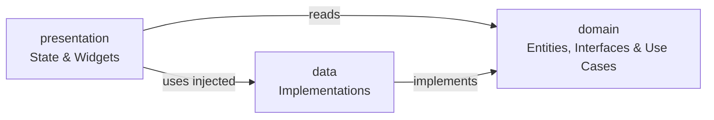

# Framework-Agnostic App Architecture

Before diving into state management libraries, it helps to understand how a typical scalable Flutter application is structured. The design pattern described below is feature-first and clean, meaning the codebase remains modular, testable, and completely independent of any specific state management library or framework.

## Feature-First Structure

The codebase is organized by grouping files by feature rather than by layer (such as putting all models in one global folder and all screens in another). This self-contained structure allows teams to work on features independently and safely delete or refactor features without breaking unrelated parts of the app.

```
lib/
├── core/                      # App-wide infrastructure
│   ├── consts/                # Strings, dimensions, etc.
│   ├── dependency_injection/  # App-wide dependency setup and wiring
│   ├── extensions/            # Dart extension methods
│   ├── routes/                # Centralised route definitions
│   └── theme/                 # App theme
│
├── features/                  # Each screen/feature is self-contained
│   ├── cart/
│   ├── favorites/
│   ├── home/
│   ├── orders/
│   ├── product/
│   ├── product_details/
│   └── splash/
│
├── shared/                    # Modules used by multiple features
│   ├── app_info/
│   ├── remote_config/
│   └── widgets/               # Reusable widgets
│
└── mock_server/               # Simulated backend (won't exist in actual production app)
```

- **`features/`** contains everything that belongs to a single screen or user-facing capability. If a feature is deleted, its folder goes with it. This includes the cart, favorites, product data, and orders; even though some of these are consumed by multiple screens, their domain, data, and presentation code lives here.
- **`shared/`** contains infrastructure modules that multiple features depend on but that have no UI of their own. Currently this is `app_info` (reading the installed app version) and `remote_config` (fetching server-driven configuration), plus reusable `widgets/`.
- **`core/`** contains infrastructure that has nothing to do with features: themes, routing, constants, and global dependencies.

## The Clean Architecture Pattern

Within each module inside `features/` or `shared/`, the code is structured into three distinct layers:

```
feature_name/
├── domain/               # Business rules (pure Dart, no framework dependency)
│   ├── entities/         # Core models specific to the feature
│   ├── repositories/     # Abstract contracts for data access
│   └── usecases/         # Feature-specific business operations
│
├── data/                 # Data layer (implements domain contracts)
│   ├── models/           # DTOs / API models and mapping logic
│   ├── data_sources/     # Remote/local APIs, persistence sources
│   └── repositories/     # Concrete implementations of domain repositories
│
└── presentation/         # UI layer (Flutter-specific code)
    ├── <state_managers>  # State management and coordination
    └── widgets/          # UI components bound to state
```

The key rule: **lower layers never import from higher ones.** Domain knows nothing about state management or UI. Data knows nothing about UI. This means you can swap the mock server for a real HTTP backend by only touching the `data/` layer.

Here's how those three layers relate to each other:



| Layer          | Depends On | Contains                                              |
| :------------- | :--------- | :---------------------------------------------------- |
| `domain`       | Nothing    | Entities, repository interfaces, use cases            |
| `data`         | `domain`   | Repository implementations, data sources, models DTOs |
| `presentation` | `domain`   | State coordinators, widgets                           |

### The Domain Layer

The domain layer is the absolute foundation of the feature. It defines the business entities, available operations, and business rules without any knowledge of database schemas, network clients, serialization formats, or UI layouts. It is pure Dart.

#### Entities

An entity is a plain Dart class representing a core business concept:

```dart
// features/product/domain/entities/product.dart
class Product {
  const Product({
    required this.id,
    required this.name,
    required this.description,
    required this.price,
    required this.imageUrl,
  });

  final String id;
  final String name;
  final String description;
  final Price price;
  final String imageUrl;
}
```

#### Repository Contracts

A repository contract is an abstract interface defining what data operations are available, without specifying how they are implemented:

```dart
// features/product/domain/repositories/product_repository.dart
abstract interface class ProductRepository {
  Future<String> getHeroProductId();

  Future<List<String>> getFeaturedProductIds();

  Future<List<Product>> getProductsByIds({
    required List<String> productIds,
    bool skipCache = false,
  });
}
```

`abstract interface class` means "this is a contract; any class that claims to be a `ProductRepository` must provide all of these methods." The rest of the app only ever talks to this interface, never to a concrete implementation directly. This is what makes swapping implementations possible.

An interface is a promise: "If you take this role, you must provide these abilities." The app only trusts the promise, not the person fulfilling it.

#### Use Cases

Use cases are plain Dart classes that encapsulate a single piece of business logic. They depend entirely on abstract repository interfaces and receive them via constructor injection:

```dart
// features/cart/domain/usecases/get_hydrated_cart.dart
class GetHydratedCartUseCase {
  const GetHydratedCartUseCase({
    required this.cartRepository,
    required this.productRepository,
  });

  final CartRepository cartRepository;
  final ProductRepository productRepository;

  Future<Cart<HydratedCartItem>> execute() async {
    final cart = await cartRepository.getOrCreateCart();

    final products = await productRepository.getProductsByIds(
      productIds: cart.items.map((i) => i.productId).toList(),
    );

    final productMap = {for (final p in products) p.id: p};
    final hydratedItems = cart.items.map((cartItem) {
      final product = productMap[cartItem.productId]!;
      return HydratedCartItem(cartItem: cartItem, product: product);
    }).toList();

    return Cart<HydratedCartItem>(
      id: cart.id,
      ownerId: cart.ownerId,
      createdAt: cart.createdAt,
      status: cart.status,
      items: hydratedItems,
      total: cart.total,
    );
  }
}
```

Use cases live in `domain/` because they contain business logic, the _what_ and _why_ of an operation - without any knowledge of Flutter or UI architectures. They receive their dependencies entirely through constructor injection.

How the other layers of the app access the use cases is demonstrated in the [Dependency Injection Concepts](02.dependency_injection.md#dependency-injection-concepts) & [Dependency Injection Wiring](02.dependency_injection.md#dependency-injection-wiring) sections.

### The Data Layer

The data layer is where the "how" lives. It contains repository implementations, data sources, and data models (DTOs) responsible for communicating with external systems, parsing raw responses, and mapping them into domain entities.

#### Models

Models are data transfer objects (DTOs) responsible for reading, writing, and parsing external data formats (like JSON). They are converted into pure domain entities before passing the data up:

These models often:

- Parse raw data (`fromJson`)
- Serialize data (`toJson`)
- Convert themselves into domain entities (`toDomain`)

For example, `CartModel` and `CartItemModel` belong to the data layer because they are responsible for reading and writing API data. Before this data is used by the application, these models are converted into domain entities such as `Cart` and `CartItem`. This keeps the domain layer focused on business rules and independent of API-specific details (unaware of JSON structures or transport formats.)

> **Note:** Why do we need both entities and models (`Cart` and `CartModel`)? Why not just make models extend entities and avoid duplicating fields? This is a common question, especially when the classes look very similar. The core reason is **decoupling**. Entities represent your business concepts, independent of how they are stored or transmitted. Models are tied to your data sources - an API might return different field names, nested structures, or validation rules that don't align perfectly with your business logic. By keeping them separate, you can change your API, database schema, or storage layer without breaking your core business rules. The mapping layer acts as a controlled translation buffer between the outside world and your business domain. This separation makes your architecture more flexible, maintainable, and testable.

#### Repository Implementations

The domain layer (which we discussed earlier) defines repository interfaces such as `ProductRepository` and `CartRepository`, but it does not provide implementations.

The data layer fulfills these contracts by providing concrete repository implementations. These repositories coordinate data sources, perform caching, transform models into domain entities, and expose the operations defined by the domain layer.

For example, `MockProductRepository` fulfills the `ProductRepository` contract by talking to the `MockServer` infrastructure:

```dart
// features/product/data/repositories/mock_product_repository.dart
final class MockProductRepository implements ProductRepository {
  final Map<String, Product> _allProductsCache = {};

  @override
  Future<List<Product>> getProductsByIds({
    required List<String> productIds,
    bool skipCache = false,
  }) async {
    final missingIds = skipCache
        ? productIds
        : productIds.where((id) => !_allProductsCache.containsKey(id)).toList();

    if (missingIds.isNotEmpty) {
      final rawProducts = await MockServer.getProductsByIds(missingIds);
      final response = ProductsPayload.fromJson(rawProducts);
      _updateCache(response.products);
    }

    return productIds
        .map((id) => _allProductsCache[id])
        .whereType<Product>()
        .toList();
  }
}
```

How the other layers of the app access the repository is demonstrated in the [Dependency Injection Concepts](02.dependency_injection.md#dependency-injection-concepts) & [Dependency Injection Wiring](02.dependency_injection.md#dependency-injection-wiring) sections.

### The Presentation Layer

The presentation layer is responsible for displaying information to users, handling user interactions, and coordinating with the application state.

#### State Coordinators

State coordinators (often referred to as controllers, ViewModels, or notifiers) sit between widgets and use cases.

They have three framework-agnostic responsibilities:

1. **Defining View State:** Holding the reactive data required by the UI to render.
2. **Intercepting Interactions:** Exposing functions that widgets can trigger.
3. **Coordinating Business Logic:** Triggering use cases and updating the state based on results.

Exactly how these state coordinators register, manage, and broadcast changes depends on the chosen state management solution.

#### Widgets

Widgets are the purely visual elements. They subscribe to the view state exposed by the state coordinators, build the UI dynamically, and forward user gestures back to the coordinators. Widgets should remain thin and free of direct data-access or business logic.
