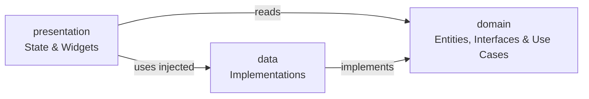

# Architecture and State Management

When building a Flutter app, you often need to share data between different screens or widgets. If you manage state by simply passing variables down through widget constructors, it can quickly become messy.

Consider a shopping cart: the home screen needs to show the number of items in the cart, the product detail screen needs to let users add items, and the checkout screen needs to list all items. If you try to pass the cart data down from the top of the app using constructor arguments, you will end up threading that data through widgets that don't even care about it just to get it to the widgets that do. This is called **prop drilling**, and it becomes unmanageable as your app grows.

To solve this problem cleanly, we need two things:
1. A clear **architecture** to organize our codebase.
2. A dedicated **state management** system to handle sharing and updating data.

## Two Kinds of State

Before reaching for a state management solution, it's worth knowing which problem you're actually solving.

**Ephemeral state** is state that lives entirely inside one widget and is nobody else's business. Whether a dropdown is open, the current value of a text field, or whether an animation is playing; that's ephemeral state. `StatefulWidget` and `setState` are perfectly fine for this.

**App state** is state that multiple parts of your app need to read or change. The shopping cart, the user's favorites list, the current user session; these belong to your app, not to any single widget. Passing this kind of state through constructors scales poorly; you need a proper solution.

## App Architecture

Before diving into state management libraries, it helps to understand how `my_store` is organized. The folder structure is not arbitrary; it follows a **feature-first clean architecture** that scales well as an app grows.

```
lib/
├── core/                      # App-wide infrastructure
│   ├── consts/                # Strings, dimensions, etc.
│   ├── dependency_injection/  # App-wide dependency setup and wiring
│   ├── extensions/            # Dart extension methods
│   ├── routes/                # Centralised route definitions
│   └── theme/                 # App theme
│
├── features/                  # Each screen/feature is self-contained
│   ├── cart/
│   ├── favorites/
│   ├── home/
│   ├── orders/
│   ├── product/
│   ├── product_details/
│   └── splash/
│
├── shared/                    # Modules used by multiple features
│   ├── app_info/
│   ├── remote_config/
│   └── widgets/               # Reusable widgets
│
└── mock_server/               # Simulated backend (won't exist in actual production app)
```

**`features/`** contains everything that belongs to a single screen or user-facing capability. If a feature is deleted, its folder goes with it. This includes the cart, favorites, product data, and orders; even though some of these are consumed by multiple screens, their domain, data, and presentation code lives here.

**`shared/`** contains infrastructure modules that multiple features depend on but that have no UI of their own. Currently this is `app_info` (reading the installed app version) and `remote_config` (fetching server-driven configuration), plus reusable `widgets/`.

**`core/`** contains infrastructure that has nothing to do with features: themes, routing, constants, and global dependencies.

### The Clean Architecture Pattern

Every module in `features/` and `shared/` follows the same internal structure:

```
feature_name/
├── domain/               # Business rules (pure Dart, no framework dependency)
│   ├── entities/         # Core models specific to the feature
│   ├── repositories/     # Abstract contracts for data access
│   └── usecases/         # Feature-specific business operations
│
├── data/                 # Data layer (implements domain contracts)
│   ├── models/           # DTOs / API models and mapping logic
│   ├── data_sources/     # Remote/local APIs, persistence sources
│   └── repositories/     # Concrete implementations of domain repositories
│
└── presentation/         # UI layer (Flutter-specific code)
    ├── <state_managers>  # State management and coordination
    └── widgets/          # UI components bound to state
```

| Layer | Depends On | Contains |
| :---- | :--------- | :------- |
| `domain` | Nothing | Entities, repository interfaces, use cases |
| `data` | `domain` | Repository implementations, data sources |
| `presentation` | `domain`, State Coordinator | State managers, UI components |

The key rule: **lower layers never import from higher ones.** Domain knows nothing about state management or UI. Data knows nothing about UI. This means you can swap the mock server for a real HTTP backend by only touching the `data/` layer.

Here's how those three layers relate to each other:



## The Domain Layer

Domain is the foundation. It defines the business entities, available operations, and business rules of the application without any knowledge of data sources, serialization formats, frameworks, or UI concerns.

### Entities

An entity is a plain Dart class representing a core concept in your app:

```dart
// features/product/domain/entities/product.dart
class Product {
  const Product({
    required this.id,
    required this.name,
    required this.description,
    required this.price,
    required this.imageUrl,
  });

  final String id;
  final String name;
  final String description;
  final Price price;
  final String imageUrl;
}
```

No Flutter UI imports. No state management libraries. Just Dart.

### Repository Contracts

A repository interface defines what data operations are available, without implementing them:

```dart
// features/product/domain/repositories/product_repository.dart
abstract interface class ProductRepository {
  Future<String> getHeroProductId();

  Future<List<String>> getFeaturedProductIds();
  
  Future<List<Product>> getProductsByIds({
    required List<String> productIds,
    bool skipCache = false,
  });
}
```

`abstract interface class` means "this is a contract; any class that claims to be a `ProductRepository` must provide all of these methods." The rest of the app only ever talks to this interface, never to a concrete implementation directly. This is what makes swapping implementations possible.

An interface is a promise: "If you take this role, you must provide these abilities." The app only trusts the promise, not the person fulfilling it.

### Use Cases

The domain layer also contains **use cases** - plain Dart classes that encapsulate a single piece of business logic. A use case takes one or more repositories and performs a specific operation with them.

```dart
// features/cart/domain/usecases/get_hydrated_cart.dart
class GetHydratedCartUseCase {
  const GetHydratedCartUseCase({
    required this.cartRepository,
    required this.productRepository,
  });

  final CartRepository cartRepository;
  final ProductRepository productRepository;

  Future<Cart<HydratedCartItem>> execute() async {
    final cart = await cartRepository.getOrCreateCart();

    final products = await productRepository.getProductsByIds(
      productIds: cart.items.map((i) => i.productId).toList(),
    );

    final productMap = {for (final p in products) p.id: p};
    final hydratedItems = cart.items.map((cartItem) {
      final product = productMap[cartItem.productId]!;
      return HydratedCartItem(cartItem: cartItem, product: product);
    }).toList();

    return Cart<HydratedCartItem>(
      id: cart.id,
      ownerId: cart.ownerId,
      createdAt: cart.createdAt,
      status: cart.status,
      items: hydratedItems,
      total: cart.total,
    );
  }
}
```

Use cases live in `domain/` because they contain business logic, the *what* and *why* of an operation - without any knowledge of Flutter or UI architectures. They receive their dependencies entirely through constructor injection.


How the other layers of the app access the use cases is demonstrated in the [dependency injection](#dependency-flow--framework-wiring) section.

## The Data Layer

The data layer is where the "how" lives. It contains repository implementations, data sources, and data models (DTOs) responsible for communicating with external systems, parsing raw responses, and mapping them into domain entities.

### Models

The data layer owns the models used to communicate with external systems such as APIs, databases, or local storage.

These models often:

* Parse raw data (`fromJson`)
* Serialize data (`toJson`)
* Convert themselves into domain entities (`toDomain`)

For example, `CartModel` and `CartItemModel` belong to the data layer because they are responsible for reading and writing API data. Before this data is used by the application, these models are converted into domain entities such as `Cart` and `CartItem`. This keeps the domain layer focused on business rules and independent of API-specific details (unaware of JSON structures or transport formats.)

> **Note:** Why do we need both entities and models (`CartModel` and `CartItemModel`)? Why not just make models extend entities and avoid duplicating fields? This is a common question, especially when the classes look very similar. The core reason is **decoupling**. Entities represent your business concepts, independent of how they are stored or transmitted. Models are tied to your data sources - an API might return different field names, nested structures, or validation rules that don't align perfectly with your business logic. By keeping them separate, you can change your API, database schema, or storage layer without breaking your core business rules. The mapping layer acts as a controlled translation buffer between the outside world and your business domain. This separation makes your architecture more flexible, maintainable, and testable.

### Repository Implementations

The domain layer (which we discussed earlier) defines repository interfaces such as `ProductRepository` and `CartRepository`, but it does not provide implementations.

The data layer fulfills these contracts by providing concrete repository implementations. These repositories coordinate data sources, perform caching, transform models into domain entities, and expose the operations defined by the domain layer.

For example, `MockProductRepository` fulfills the `ProductRepository` contract by talking to the `MockServer` infrastructure:

```dart
// features/product/data/repositories/mock_product_repository.dart
final class MockProductRepository implements ProductRepository {
  final Map<String, Product> _allProductsCache = {};

  @override
  Future<List<Product>> getProductsByIds({
    required List<String> productIds,
    bool skipCache = false,
  }) async {
    final missingIds = skipCache
        ? productIds
        : productIds.where((id) => !_allProductsCache.containsKey(id)).toList();

    if (missingIds.isNotEmpty) {
      final rawProducts = await MockServer.getProductsByIds(missingIds);
      final response = ProductsPayload.fromJson(rawProducts);
      _updateCache(response.products);
    }

    return productIds
        .map((id) => _allProductsCache[id])
        .whereType<Product>()
        .toList();
  }
}
```

How the other layers of the app access the repository is demonstrated in the [dependency injection](#dependency-flow--framework-wiring) section.

## The Presentation Layer

The presentation layer is responsible for displaying information to users, handling user interactions, and coordinating with the application state.

Exactly how state is managed and wired depends entirely on the chosen state management solution.

### State Managers / `<your_state_manager>`

The presentation layer utilizes a dedicated directory - commonly named `controllers/`, `bloc/`, `view_models/`, or `state_managers/` depending on your preference - to house the classes responsible for acting as the bridge between raw user interactions and your domain's business logic.

Irrespective of the specific pattern or library chosen, this state-coordinating component has three clear, framework-agnostic responsibilities:

1. **Defining View State:** It shapes and holds the specific properties required by the UI to draw a screen safely (e.g., active loading states, populated data lists, or error state bundles).
2. **Intercepting Interactions:** It exposes public actions and methods that widgets trigger when a user interacts with the user interface (e.g., clicking an "Add to Cart" button).
3. **Coordinating Business Logic:** It executes your domain's use cases, listens to incoming data adjustments, and republishes updated state snapshots down to the user interface.

Exactly how these state coordinators register, manage, and broadcast changes is a framework decision.

In this project, these abstract responsibilities are realized using Riverpod's **Notifiers** and **Providers**, which are covered in deep detail in the upcoming [Guide](#state-management-with-riverpod).

### Widgets

Widgets are the visual layer of the application. Their responsibility is to display current state configurations and safely forward direct user interactions to the state-management layer.

Widgets should avoid performing heavy business logic or calling raw data access repositories directly. Instead, they watch state, react instantly to changes, and notify business logic layers when users interact with the UI.

## Dependency Flow & Framework Wiring

Now that we have covered the three foundational layers (Domain, Data, and Presentation), we need a way to wire them together. In this project, **Riverpod** acts as our dependency injection (DI) container and our state coordination glue.

The application's structural dependencies flow downward like this:

```
Repository Providers (Data Wiring)
         ↓
Use Case Providers (Business Logic Wiring)
         ↓
State Notifiers (State Management)
         ↓
Flutter Widgets (UI View)
```

### Riverpod Building Blocks

Riverpod revolves around two core ideas:

* **Creating and exposing values** through providers using annotations such as `@riverpod` and `@Riverpod(...)`.
* **Accessing those values** from other providers using `ref.watch(...)` or `ref.read(...)`.

We will check both concepts in detail in [State Management with Riverpod](#state-management-with-riverpod). If you wanna skip this section (Riverpod Building Blocks) and circle back later, that's fine. We have already hyperlinked the relevant section.

#### Provider Annotations

`@riverpod` and `@Riverpod(...)` are [code-generation annotations](#code-generation) that turn a function into a provider.

```dart
@riverpod
MyService myService(Ref ref) {
  return MyService();
}
```

The generated provider can then be accessed throughout the application.

By default, some providers may be disposed when no longer in use. Applying `@Riverpod(keepAlive: true)` tells Riverpod to keep the provider alive for the lifetime of the application. This is useful for long-lived dependencies such as repositories.

#### quick run on ref.watch vs ref.read

When a provider needs something from another provider, it uses Ref.

```dart
final repository = ref.watch(repositoryProvider);
```

* `ref.watch(...)` creates a dependency relationship.
* `ref.read(...)` accesses a provider without listening for changes.

We'll explore their behavioral differences in detail in [ref.watch() vs ref.read()](#refwatch-vs-refread), but for now it's enough to know that both are used to retrieve dependencies from the provider graph.

### Repository Providers (Data Wiring)

Repositories are shared dependencies used throughout the application lifecycle. Instead of manually instantiating repository classes across multiple files, we register them in a single place: `core/dependency_injection/repository_providers.dart`.

Think of this file as the application's "supply room". It creates each concrete implementation and exposes them to the app via global providers so use case layers can safely access them.

```dart
// core/dependency_injection/repository_providers.dart
@Riverpod(keepAlive: true)
ProductRepository productRepository(Ref ref) {
  return MockProductRepository();
}

@Riverpod(keepAlive: true)
CartRepository cartRepository(Ref ref) {
  return MockCartRepository();
}

@Riverpod(keepAlive: true)
FavoritesRepository favoritesRepository(Ref ref) {
  return MockFavoritesRepository();
}

```

`@Riverpod(keepAlive: true)` ensures the provider state and its underlying repository instance are never disposed or dropped out of memory when navigation changes. This is appropriate for repositories because they maintain underlying local caches meant to survive user navigation flows.

### Use Case Providers (Business Wiring)

While the absolute definitions of use cases belong purely to the framework-agnostic domain layer, configuring how they are provided and wired is a presentation-layer setup concern.

To keep the domain layer completely clean of state management libraries, the providers responsible for creating and injecting dependencies live inside `presentation/providers/`. Their single responsibility is structural dependency wiring: constructing use case instances with the concrete repositories they require.

Remember the application's "supply room" from the [repository providers](#repository-providers-data-wiring)? Use case providers take the raw parts stored there (repositories) and assemble them into ready-to-use business tools (use cases) that notifiers can work with.

```dart
// features/cart/presentation/providers/cart_usecase_providers.dart
@riverpod
GetHydratedCartUseCase getHydratedCartUseCase(Ref ref) {
  return GetHydratedCartUseCase(
    cartRepository: ref.watch(cartRepositoryProvider),
    productRepository: ref.watch(productRepositoryProvider),
  );
}

@riverpod
UpdateCartItemUseCase updateCartItemUseCase(Ref ref) {
  return UpdateCartItemUseCase(
    cartRepository: ref.watch(cartRepositoryProvider),
    productRepository: ref.watch(productRepositoryProvider),
  );
}

```

Notifiers purposefully watch use case providers rather than raw repositories directly. This keeps the notifier focused cleanly on user interaction state management, while use cases handle the coordination of business rules.

## State Management with Riverpod

So far, we've focused entirely on structural architecture layers and explicit responsibilities.

The remaining question is how state is actually created, shared, observed, and updated cleanly throughout the application. In this project, that responsibility is handled comprehensively by Riverpod.

### Why Riverpod?

Flutter has several state management options. Riverpod is an excellent choice for scaling production applications because:

* Providers are **compile-safe**: typos in provider names fail at compile time, not at runtime.
* Providers don't require a `BuildContext` to be read or written from Dart code outside widgets.
* Providers are **lazy** by default: they only run when something is actively listening.
* Everything is **reactive**: widgets automatically rebuild when the state they're watching changes.

This project uses two packages, which you can locate in `pubspec.yaml`:

```yaml
dependencies:
  flutter_riverpod: ^3.3.1    # The core library
  riverpod_annotation: ^4.0.2 # Annotations for code generation

dev_dependencies:
  build_runner: ^2.15.0       # Runs the code generator
  riverpod_generator: ^4.0.3  # The actual generator

```

`flutter_riverpod` is the runtime engine. `riverpod_annotation` + `riverpod_generator` let you write clean providers with annotations (`@riverpod`) instead of writing repetitive boilerplate by hand.

| Package               | Role                                                                             |
| --------------------- | -------------------------------------------------------------------------------- |
| `flutter_riverpod`    | The restaurant  |
| `riverpod_annotation` | The recipe cards/menu labels that tell the chef what to cook |
| `riverpod_generator`  | The chef who reads the recipe cards and generates code                           |
| `build_runner`        | The restaurant manager who tells the chef to start cooking                       |

### `ProviderScope` - The Root of Everything

Riverpod needs a `ProviderScope` widget at the very top of your widget tree. It acts as the global container that safely stores all provider states. Nothing Riverpod-related works without it.

```dart
// main.dart
void main() {
  runApp(ProviderScope(retry: (retryCount, error) => null, child: const App()));
}
```

The `retry` parameter controls what happens when an async provider throws an error. Setting it to `null` means "don't automatically retry, let the UI explicitly handle it."

## Riverpod Fundamentals

### Code Generation

We did briefly touch base on this during the [dependency injection](#dependency-flow--framework-wiring) > [Riverpod Building Blocks](#riverpod-building-blocks) > [Provider Annotations](#provider-annotations) section.

Writing Riverpod providers by hand requires a lot of manual boilerplate. Instead, you annotate a class or function with `@riverpod`, run the generator, and it writes the underlying plumbing code for you.

Here's an example of a provider class you write:

```dart
// features/product/presentation/providers/product_notifier.dart
import 'package:riverpod_annotation/riverpod_annotation.dart';

part 'product_notifier.g.dart'; // <- tells Dart: generated code lives here

@riverpod
class ProductNotifier extends _$ProductNotifier {
  @override
  Future<Product?> build(String id) async {
    final useCase = ref.watch(getProductByIdUseCaseProvider);
    return useCase.execute(id);
  }
}
```

The `part 'product_notifier.g.dart'` directive tells Dart that some of this file's code lives in an external generated file. The `_$ProductNotifier` class is generated; it provides the foundational `ref` property, hooks up lifecycles, and manages state plumbing you never have to touch manually.

To generate or re-generate the `.g.dart` files, run:

```bash
dart run build_runner build
```

The generated file creates a global `productProvider` that you use inside your application widgets. You never call `ProductNotifier` directly; you always interact through the generated provider.

> **Tip:** You don't need to read `.g.dart` files. They are an implementation detail. Treat it like compiled output: generated, and never maintained by hand.

### `AsyncNotifier` - Asynchronous State Management

Most real-world providers do async work: fetching from a server, reading from databases, or parsing files. The `build` method returning a `Future` is what makes a provider asynchronous:

```dart
@riverpod
class HomeNotifier extends _$HomeNotifier {
  @override
  Future<HomePageData> build() async {
    final getHomePageData = ref.watch(getHomePageDataUseCaseProvider);
    return getHomePageData.execute();
  }
}
```

The notifier delegates to the use case. The use case (`GetHomePageDataUseCase`) does the actual work of firing two requests in parallel and assembling the result. The notifier's job is just to wire it up to Riverpod.

When `build` returns a `Future`, Riverpod automatically wraps the result in an `AsyncValue<T>`. This keeps providers focused on their main responsibility: producing state. Instead of manually managing loading flags and updating state inside `try/catch` blocks, the notifier only needs to describe how the data is loaded while Riverpod handles the state transitions automatically.

`AsyncValue<T>` represents one of three possible architectural states:

```
AsyncValue<T>
  ├── AsyncLoading   - the future hasn't resolved yet
  ├── AsyncData<T>   - success, holds the resolved state value
  └── AsyncError     - failure, holds the error and stack trace
```

### `ConsumerWidget` and Reading State

To read a provider state within a widget, extend `ConsumerWidget` instead of standard `StatelessWidget`. The only operational difference is an extra `WidgetRef ref` parameter provided in your `build` method:

```dart
class HomePage extends ConsumerWidget {
  @override
  Widget build(BuildContext context, WidgetRef ref) {
    final homePageDataAsync = ref.watch(homeProvider);

    return Scaffold(
      body: homePageDataAsync.when(
        loading: () => const Center(child: CircularProgressIndicator()),
        error: (error, _) => Center(
          child: GenericErrorView(
            onRetry: () => ref.invalidate(homeProvider),
          ),
        ),
        data: (homePageData) => _HomePageBody(homePageData: homePageData),
      ),
    );
  }
}
```

`.when()` is the cleanest way to handle all three `AsyncValue` states exhaustively in one block, ensuring loading and error states are never ignored.

#### `ref.watch` vs `ref.read`

We did briefly touch base on this during the [dependency injection](#dependency-flow--framework-wiring) > [Riverpod Building Blocks](#riverpod-building-blocks) > [Quick run on ref.watch vs ref.read](#quick-run-on-refwatch-vs-refread) section.

Understanding when to use watch versus read is crucial to proper application performance. The TLDR; is that **`watch` subscribes to changes while `read` does not subscribe**:

| Operation | `ref.watch` | `ref.read` |
| --- | --- | --- |
| **Subscribes?** | Yes: widget rebuilds when state changes | No: one-time value read |
| **Usage Location** | Inside the `build()` method body | Inside user callbacks, click handlers, actions |
| **Purpose** | Keeps UI synchronized with state | Fetches current value or calls state notifiers |

```dart
// Correct: watch inside build, so the cart badge updates when cart changes
final cartAsync = ref.watch(cartProvider);

// Correct: read in a click callback; you don't need to dynamically subscribe
void onPressed() {
  ref.read(cartProvider.notifier).addItem(product.id);
}

// Wrong: never watch inside a callback execution block, it does nothing useful
void onPressed() {
  ref.watch(cartProvider); // pointless and potentially harmful
}
```

### Parameterised Providers (Family)

Sometimes you need to request the same type of data using distinct inputs, such as a single `Product` entity matched per unique product ID. Riverpod handles this via **family providers**: pass an argument directly to the provider setup to automatically generate a unique state instance for that specific key.

```dart
@riverpod
class ProductNotifier extends _$ProductNotifier {
  @override
  Future<Product?> build(String id) async { // <- The parameterizing argument
    final useCase = ref.watch(getProductByIdUseCaseProvider);
    return useCase.execute(id);
  }
}
```

Inside widgets, you subscribe to the provider by passing the parameter value:

```dart
// Watches the product with this specific ID
// A different widget watching a different ID won't cause this widget to rebuild
final productAsync = ref.watch(productProvider('product-abc-123'));
```

Each argument creates its own isolated provider state instance under the hood. Five widgets watching five completely different product IDs instantiate five separate providers with zero shared rebuild overhead.

### Cross-Provider Dependencies

Providers can naturally depend on, react to, and watch other providers. For example, `CartNotifier` reads from a cart use-case provider, which itself watches both the cart repository and product repository providers to join simple data IDs with full `Product` business entities:

```dart
@riverpod
class CartNotifier extends _$CartNotifier {
  @override
  Future<CartSnapshot<HydratedCartItem>> build() async {
    final getHydratedCart = ref.watch(getHydratedCartUseCaseProvider);
    final cart = await getHydratedCart.execute();
    return CartSnapshot(isMutating: false, cart: cart);
  }
}
```

`HydratedCartItem` is a simple business pair: the raw cart line item plus its fully resolved `Product` entity details. This data joining is processed completely inside the use case, keeping the structural notifier clean.

When `cartRepositoryProvider` or `productRepositoryProvider` emits a state change, the use case provider rebuilds automatically (since it watches them), which subsequently forces `CartNotifier` to safely refresh its internal state. Dependencies are tracked reactively across layers.

### `ref.invalidate` - Forcing a Refresh

Invalidating a provider explicitly disposes its current state cache and forces it to rebuild from scratch. This is how clean retry buttons are built:

```dart
// Force the home page provider to re-fetch all data
onRetry: () => ref.invalidate(homeProvider),

// Invalidate only a specific product instance (family providers require the original argument)
ref.invalidate(productProvider('product-abc-123'));
```

Inside a notifier class, use `ref.invalidateSelf()` to invalidate and re-run the specific provider context you are currently executing within:

```dart
// After successfully placing an order, refresh the local cart state completely
ref.invalidateSelf();
```

### Mutating State - Writing Back to Providers

Providers don't just read data, they expose structured methods to change it. In `CartNotifier`, public methods like `addItem`, `removeItem`, and `updateQuantity` provide safe channels for widgets to request mutations:

```dart
Future<void> addItem(String productId) async {
  final existing = await _getItemByID(productId);
  return _updateQuantity(productId, (existing?.cartItem.quantity ?? 0) + 1);
}
```

Widgets trigger these mutations cleanly by accessing the state **notifier** via a read operation inside interactions:

```dart
// In a widget's button callback handler:
ref.read(cartProvider.notifier).addItem(product.id);
```

Note the use of `ref.read` here, not `ref.watch` because within interaction callbacks, you simply need a reference to the notifier once to fire the action, not to establish a dynamic UI subscription. More details in [ref.watch vs ref.read](#refwatch-vs-refread) section.

#### The `isMutating` Flag & Optimistic Updates

When updating the cart, we intentionally avoid switching to `AsyncLoading`. If we did, the current cart data would no longer be available to the UI, causing the cart contents to disappear while the request is in progress.

Instead, we keep the existing cart data and use an `isMutating` flag to indicate that an update is running in the background. This allows the UI to continue displaying the cart while showing a loading overlay, disabled controls, or other progress indicators.

The `isMutating` flag also prevents users from accidentally triggering duplicate requests while an operation is already in flight:

```dart
Future<void> _updateQuantity(String productId, int quantity) async {
  final snapshot = state.value ?? await future;
  if (snapshot.isMutating) return; // Already busy processing, ignore incoming action

  // 1. Update the UI immediately (Optimistic Update)
  final optimisticCart = snapshot.cart.updateItemQuantity(productId, quantity);
  state = AsyncData(snapshot.copyWith(
    isMutating: true,
    cart: optimisticCart,
  ));

  final updateCartItem = ref.read(updateCartItemUseCaseProvider);

  try {
    // 2. Execute network request via the use case
    final updatedCart = await updateCartItem.execute(
      cartId: optimisticCart.id,
      productId: productId,
      quantity: quantity,
      optimisticCartTotal: optimisticCart.total,
    );

    // 3. Replace the optimistic state with verified server data
    state = AsyncData(
      CartSnapshot(
        isMutating: false,
        cart: updatedCart,
      ),
    );
  } catch (e, st) {
    // 4. Roll back to original state on network failure
    state = AsyncData(snapshot.copyWith(isMutating: false));
    state = AsyncError(e, st);
  }
}
```

This represents the **optimistic update** pattern: the UI is updated immediately before the backend responds (with loading overlay), creating a fast and responsive user experience.

The `isMutating` flag serves two purposes:

* It preserves the current cart data during mutations, allowing the UI to remain visible while displaying loading indicators or overlays.
* It prevents duplicate mutation requests while an operation is already in flight.

Once the server responds, the optimistic state is either confirmed with the authoritative server data or rolled back if an error occurs.

### Shared Widgets with Built-In Provider Logic

One of Riverpod's major design advantages is that any standard `ConsumerWidget` can easily connect to providers without requiring data to be passed manually through deep chains of widget constructors. This allows developers to build independent, **self-contained smart widgets** that cleanly manage their own state subscriptions.

#### `AddToCartButton`

```dart
class AddToCartButton extends ConsumerWidget {
  const AddToCartButton({required this.product, ...});

  @override
  Widget build(BuildContext context, WidgetRef ref) {
    void onPressed() {
      final snapshot = ref.read(cartProvider);
      if (snapshot.value?.isMutating ?? false) {
        AppSnackBar.showErrorSnackBar(context, message: 'Processing...');
        return;
      }
      ref.read(cartProvider.notifier).addItem(product.id);
      AppSnackBar.showSuccessSnackBar(context, message: '${product.name} added to cart');
    }

    return PrimaryButton(text: 'Add to Cart', onTap: onPressed);
  }
}
```

This component observes the cart mutation state, stops duplicate actions, coordinates updates with the notifier, and handles user alerts internally. The parent container widget simply supplies the target `Product` instance parameter and has no extra coupling layout roles.

#### `FavoriteButton` - Mixing Local and Provider State

Certain UI elements require both local ephemeral state (such as managing an explicit animation track) and global provider state (determining if an item is favorited). For these mixed state scenarios, leverage a `ConsumerStatefulWidget`:

```dart
class FavoriteButton extends ConsumerStatefulWidget { ... }

class _FavoriteButtonState extends ConsumerState<FavoriteButton>
    with SingleTickerProviderStateMixin {

  late final AnimationController _controller; // Local ephemeral animation state

  @override
  Widget build(BuildContext context) {
    // Provider state, Is this specific product ID marked favorited?
    final isFavorite = ref.watch(
      favoritesProvider.select(
        (s) => s.value?.contains(widget.productId) ?? false,
      ),
    );

    return GestureDetector(
      onTap: () {
        _controller.forward(from: 0.0); // Trigger animation locally
        ref.read(favoritesProvider.notifier).toggle(widget.productId); // Mutate global state
      },
      child: AnimatedSwitcher(
        child: Icon(isFavorite ? Icons.favorite : Icons.favorite_border, ...),
      ),
    );
  }
}
```

`ConsumerState` functions exactly like a traditional Flutter `State` object class, but has a native `ref` property globally built right into its core layout.

### Selective Rebuilds with `.select`

Observe the use of the `.select` query filter within our `FavoriteButton` example:

```dart
ref.watch(
  favoritesProvider.select(
    (s) => s.value?.contains(widget.productId) ?? false,
  ),
);
```

Without applying `.select`, this widget would trigger an expensive visual rebuild every single time *any* product is added or removed from favorites. Utilizing `.select` optimizes the widget subscription: this item will execute a rebuild *only* when the exact boolean result for *this specific product ID* alters. Within lists containing thousands of items, this provides critical performance preservation.

### Sealed Classes for Complex State Management

Sometimes a provider state isn't modeled well by simple "loading, data, error" branches, it can represent one of multiple unique structural states carrying different data definitions. Dart's `sealed class` architectures handle these situations perfectly.

For instance, a splash screen execution flow might determine three completely distinct application routing states after boot checks complete:

```dart
// features/splash/domain/entities/splash_state.dart
sealed class SplashState {
  const SplashState();
}

class Success extends SplashState {
  const Success();
}

class UnderMaintenance extends SplashState {
  const UnderMaintenance({required this.message, this.details});
  final String message;
  final String? details;
}

class ForceUpdate extends SplashState {
  const ForceUpdate({required this.message, this.details});
  final String message;
  final String? details;
}
```

The matching use case evaluates device data configuration and returns one of the clean sealed models:

```dart
// features/splash/domain/usecases/check_app_status.dart
class CheckAppStatusUseCase {
  Future<SplashState> execute() async {
    final (currentBuildNumber, _) = await (
      appInfoRepository.readAppBuildNumber(),
      remoteConfigRepository.fetchRemoteConfig(),
    ).wait;

    final config = remoteConfigRepository.getRemoteConfig();

    if (config.maintenanceConfig.isInMaintenanceMode) {
      return UnderMaintenance(message: config.maintenanceConfig.message, ...);
    }

    if (currentBuildNumber < config.minSupportedBuildNumber) {
      return const ForceUpdate(message: 'New Version Available', ...);
    }

    return const Success();
  }
}
```

The presentation notifier can then map directly to the result:

```dart
@riverpod
class SplashNotifier extends _$SplashNotifier {
  @override
  Future<SplashState> build() async {
    final checkAppStatus = ref.watch(checkAppStatusUseCaseProvider);
    return checkAppStatus.execute();
  }
}
```

Inside your Flutter widgets, performing a standard `switch` statement on the sealed class enforces **exhaustive pattern matching**, the Dart compiler will throw an explicit compilation error if you accidentally forget to handle a case scenario:

```dart
final splashState = splashStateAsync.value;
switch (splashState) {
  case Success():        SplashPageContent();
  case UnderMaintenance(): SplashMaintenanceView(message: splashState.message);
  case ForceUpdate():      SplashForceUpdateView(message: splashState.message);
}
```

Because the compiler tracks every subclass definition of the sealed state model, introducing a new variant requires you to update all UI switch sites immediately, avoiding unexpected runtime layout failures.

## The `my_store` app

The `my_store` folder contains a complete e-commerce app that puts all the concepts from this module into practice.

### What you'll learn from it

**Feature-first clean architecture**; every module in `features/` and `shared/` follows the `domain/` → `data/` → `presentation/` structure, with `domain/` containing a `usecases/` directory that encapsulates business logic separately from the notifier.

**Centralised dependency injection**; `core/dependency_injection/repository_providers.dart` is the single place where all repositories are created and wired up. All repository providers use `@Riverpod(keepAlive: true)` so their caches survive widget disposal.

**Use case providers as the bridge between data and presentation**; each feature has its own use case providers (e.g. `cart_usecase_providers.dart`) that instantiate use cases with the right repositories. Notifiers depend on use cases, not repositories directly.

**`ProviderScope` at the root**; `main.dart` wraps the app in `ProviderScope` with automatic retry disabled, so error handling is left to the UI.

**Async providers with `.when()`**; every page (`HomePage`, `CartPage`, `OrdersPage`) watches an async notifier and uses `.when()` to render loading spinners, error views with retry buttons, and the actual content.

**Parameterised providers**; `productProvider(productId)` is a family provider. The home page, product details page, and orders page each watch the same provider with different IDs, getting independent provider instances with no shared rebuild overhead.

**Cross-provider dependencies**; `GetHydratedCartUseCase` joins cart items with product data, and the cart use case provider watches both `cartRepositoryProvider` and `productRepositoryProvider`, so the notifier rebuilds whenever either changes.

**Optimistic updates and rollback**; `CartNotifier._updateQuantity` updates the UI instantly before the server confirms, then rolls back on failure.

**Self-contained smart widgets**; `AddToCartButton`, `FavoriteButton`, and `CartBadge` each connect to their providers internally. Parents pass only the product or product ID, no callback props needed.

**Selective rebuilds**; `FavoriteButton` uses `.select` to subscribe only to the boolean for its specific product, avoiding unnecessary rebuilds when other favorites change.

**Sealed class state**; `SplashState` is a sealed class with `Success`, `UnderMaintenance`, and `ForceUpdate`. The compiler enforces that every case is handled everywhere `SplashState` is used.

**Debounced quantity updates**; the quantity selector in `CartPage` uses a local `Timer` to wait 750ms after the last tap before firing the network request, avoiding a request on every individual `+` / `-` press.

### How to run

```bash
cd my_store
flutter pub get
dart run build_runner build  # generate the .g.dart files
flutter run
```
