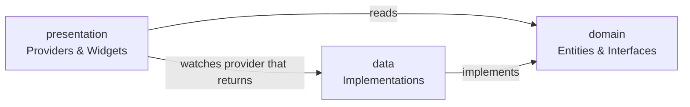

# State Management

In the previous section, you handled the filters screen by lifting state up into `_MyAppState` and passing it down as constructor arguments — `currentFilters` going in, `setFiltersHandler` going out. That works for one screen, but consider what happens when three unrelated screens all need to know how many items are in the cart. You'd have to thread the cart count through every widget in between, even the ones that have nothing to do with it. This is called **prop drilling**, and it becomes unmanageable quickly.

This section covers how to solve that with **Riverpod**, a reactive state management library for Flutter.

## Two kinds of state

Before reaching for a state management solution, it's worth knowing which problem you're actually solving.

**Ephemeral state** is state that lives entirely inside one widget and is nobody else's business. Whether a dropdown is open, the current value of a text field, or whether an animation is playing — that's ephemeral state. `StatefulWidget` and `setState` are perfectly fine for this.

**App state** is state that multiple parts of your app need to read or change. The shopping cart, the user's favorites list, the current user session — these belong to your app, not to any single widget. Passing this kind of state through constructors scales poorly; you need a proper solution.

## Why Riverpod?

Flutter has several state management options. Riverpod is a good choice for learning because:

- Providers are **compile-safe** — typos in provider names fail at compile time, not at runtime.
- Providers don't require `BuildContext` to be read or written from Dart code outside widgets.
- Providers are **lazy** by default — they only run when something is listening.
- Everything is **reactive** — widgets automatically rebuild when the state they're watching changes.

This project uses two packages. You can see them in `pubspec.yaml`:

```yaml
dependencies:
  flutter_riverpod: ^3.3.1    # The core library
  riverpod_annotation: ^4.0.2 # Annotations for code generation

dev_dependencies:
  build_runner: ^2.15.0       # Runs the code generator
  riverpod_generator: ^4.0.3  # The actual generator
```

`flutter_riverpod` is the runtime. `riverpod_annotation` + `riverpod_generator` let you write providers with annotations (`@riverpod`) instead of writing boilerplate by hand.

## `ProviderScope` — the root of everything

Riverpod needs a `ProviderScope` widget at the very top of your widget tree. It acts as the container that stores all provider state. Nothing Riverpod-related works without it.

```dart
// main.dart
void main() {
  runApp(
    ProviderScope(
      retry: (retryCount, error) => null, // disable automatic retry
      child: const App(),
    ),
  );
}
```

The `retry` parameter controls what happens when an async provider throws. Setting it to `null` means "don't automatically retry — let the UI handle it."

## App architecture — feature-first folders

Before diving into Riverpod itself, it helps to understand how `my_store` is organised. The folder structure is not arbitrary; it follows a **feature-first, layered architecture** that scales well as an app grows.

```
lib/
├── core/              # App-wide utilities
│   ├── consts/        # Strings, dimensions, etc.
│   ├── extensions/    # Dart extension methods
│   ├── routes/        # Centralised route definitions
│   └── theme/         # App theme
│
├── features/          # Each screen is a feature
│   ├── cart/
│   ├── home/
│   ├── orders/
│   ├── product_details/
│   └── splash/
│
├── shared/            # State & widgets used by multiple features
│   ├── cart/
│   ├── favorites/
│   ├── product/
│   ├── remote_config/
│   └── widgets/
│
└── mock_server/       # Simulated backend with artificial delays
```

**`features/`** contains everything that belongs to a single screen. If a screen is deleted, its folder goes with it.

**`shared/`** contains state and widgets that multiple features depend on. The cart, for example, is needed on the home page (badge), product details page (add button), and the cart page itself — so it lives in `shared/`.

**`core/`** contains infrastructure that has nothing to do with features: themes, routing, constants.

### The three-layer pattern

Every module in `features/` and `shared/` follows the same internal structure:

```
product/
├── domain/            # Pure Dart: what a product IS
│   ├── entities/      # Data classes (Product, Price)
│   └── repositories/  # Interfaces (abstract contracts)
├── data/              # How data is fetched
│   ├── data_sources/
│   └── repositories/  # Implementations of domain interfaces
└── presentation/      # Flutter: providers and widgets
    └── providers/
```

| Layer | Depends on | Contains |
| :---- | :--------- | :------- |
| `domain` | Nothing (pure Dart) | Entities, repository interfaces |
| `data` | `domain` | Repository implementations, data sources |
| `presentation` | `domain`, Riverpod | Providers, widgets |

The key rule: **lower layers never import from higher ones.** Domain knows nothing about Riverpod. Data knows nothing about Flutter widgets. This means you can swap the mock server for a real HTTP backend by only touching the `data/` layer.



## The domain layer — entities and repository contracts

Domain is the foundation. It defines what your data looks like and what operations exist, without caring how they're implemented.

A **entity** is a plain Dart class representing a concept in your app:

```dart
// shared/product/domain/entities/product.dart
class Product {
  const Product({
    required this.id,
    required this.name,
    required this.description,
    required this.price,
    required this.imageUrl,
  });

  factory Product.fromJson(Map<String, dynamic> json) { ... }

  final String id;
  final String name;
  final String description;
  final Price price;
  final String imageUrl;
}
```

No Flutter imports. No Riverpod. Just Dart.

A **repository interface** defines what data operations are available, without implementing them:

```dart
// shared/product/domain/repositories/product_repository.dart
abstract interface class ProductRepository {
  Future<String> getHeroProductId();
  Future<List<String>> getFeaturedProductIds();
  Future<List<Product>> getProductsByIds({
    required List<String> productIds,
    bool skipCache = false,
  });
}
```

The `abstract interface class` keyword means "this is a contract — implement it, don't extend it." Any class that implements `ProductRepository` must provide all three methods. The rest of the app only ever talks to this interface, never to a concrete implementation directly.

## The data layer — implementing the contract

The data layer provides concrete implementations of domain interfaces. `MockProductRepository` fulfills the `ProductRepository` contract by talking to the `MockServer`:

```dart
// shared/product/data/repositories/mock_product_repository.dart
final class MockProductRepository implements ProductRepository {
  final Map<String, Product> _allProductsCache = {};

  @override
  Future<List<Product>> getProductsByIds({
    required List<String> productIds,
    bool skipCache = false,
  }) async {
    final missingIds = skipCache
        ? productIds
        : productIds.where((id) => !_allProductsCache.containsKey(id)).toList();

    if (missingIds.isNotEmpty) {
      final rawProducts = await MockServer.getProductsByIds(missingIds);
      final response = ProductsPayload.fromJson(rawProducts);
      _updateCache(response.products);
    }

    return productIds
        .map((id) => _allProductsCache[id])
        .whereType<Product>()
        .toList();
  }
}
```

Notice the in-memory cache: if a product has already been fetched, it's returned immediately without hitting the server again. This is a pattern you'll commonly see in real apps.

### Providing the repository to the rest of the app

The repository isn't used directly by widgets — it's wrapped in a Riverpod provider so the rest of the app can get hold of it:

```dart
// shared/product/data/repositories/product_repository_provider.dart
@Riverpod(keepAlive: true)
ProductRepository productRepository(Ref ref) {
  return MockProductRepository();
}
```

The `@Riverpod(keepAlive: true)` annotation is important. By default, Riverpod **disposes** a provider when no widget is listening to it. For a UI state provider (like loading data for a screen), that's fine — the data should be refreshed when you navigate back. But for a repository that holds an in-memory cache, disposing it would throw away all the cached data. `keepAlive: true` tells Riverpod to keep this provider alive for the entire lifetime of the app.

> **Note:** `@Riverpod(keepAlive: true)` is the annotation equivalent of the lowercase `@riverpod`. The difference is exactly this: `@riverpod` creates an auto-disposable provider, `@Riverpod(keepAlive: true)` creates one that lives forever. Use `keepAlive` sparingly, for things like repositories, database connections, or shared services.

## The presentation layer — providers and widgets

The presentation layer is the bridge between your data and your UI. It holds two things:

- **Providers** — classes annotated with `@riverpod` that fetch data from repositories, hold state, and expose methods for mutations. They live in a `presentation/providers/` subfolder alongside the feature or shared module they belong to.
- **Feature-specific widgets** — Flutter widgets that watch providers and render the UI. These may live in `presentation/` inside a feature folder, or inside `shared/widgets/` if they're reused across multiple features.

```
shared/product/presentation/
└── providers/
    ├── product_notifier.dart    ← the provider you write
    └── product_notifier.g.dart  ← generated by build_runner (never edit this)

shared/cart/presentation/
├── providers/
│   ├── cart_notifier.dart
│   └── cart_notifier.g.dart
└── widgets/
    ├── add_to_cart_button.dart  ← ConsumerWidget, connects to cartProvider
    └── cart_badge.dart
```

The presentation layer is the only layer that imports from Riverpod and Flutter. Domain and data layers stay pure Dart — that's the boundary that makes the architecture maintainable.

The rest of this section focuses on how to build presentation layer code: how providers are written, how widgets connect to them, and how state mutations work.

## Riverpod fundamentals

### Code generation — what `@riverpod` does

Writing Riverpod providers by hand requires a lot of boilerplate. Instead, you annotate a class or function with `@riverpod`, run the generator, and it writes the boilerplate for you.

Here's a provider you write:

```dart
// shared/product/presentation/providers/product_notifier.dart
import 'package:riverpod_annotation/riverpod_annotation.dart';

part 'product_notifier.g.dart'; // ← tells Dart: generated code lives here

@riverpod
class ProductNotifier extends _$ProductNotifier {
  @override
  Future<Product?> build(String id) async {
    final repository = ref.watch(productRepositoryProvider);
    final products = await repository.getProductsByIds(productIds: [id]);
    return products.firstOrNull;
  }
}
```

The `part 'product_notifier.g.dart'` directive tells Dart that some of this file's code lives in a generated file. The `_$ProductNotifier` class (underscore, dollar sign) is generated — it provides the `ref` property, wires up the lifecycle hooks, and does other plumbing you never have to touch.

To generate or re-generate the `.g.dart` files, run:

```bash
dart run build_runner build
# or, to watch for changes automatically:
dart run build_runner watch
```

The generated file creates a `productProvider` that you use in your widgets. You never call `ProductNotifier` directly — you always go through the generated provider.

> **Tip:** You don't need to read `.g.dart` files. They're implementation detail. If you're curious, open one — but treat it like compiled output: generated, not maintained by hand.

### `AsyncNotifier` — providers that load data asynchronously

Most real-world providers do async work: fetch from a server, read from a database, parse a file. The `build` method returning a `Future` is what makes a provider asynchronous:

```dart
@riverpod
class HomeNotifier extends _$HomeNotifier {
  @override
  Future<HomePageData> build() async {
    final repository = ref.watch(productRepositoryProvider);

    // Fire two requests in parallel and wait for both
    final (heroProductId, featuredProductIds) = await (
      repository.getHeroProductId(),
      repository.getFeaturedProductIds(),
    ).wait;

    return HomePageData(
      heroProductId: heroProductId,
      featuredProductIds: featuredProductIds,
    );
  }
}
```

When `build` returns a `Future`, Riverpod wraps the result in an `AsyncValue<T>`. This is a type that represents one of three possible states:

```
AsyncValue<T>
  ├── AsyncLoading   — the future hasn't resolved yet
  ├── AsyncData<T>   — success, holds the value
  └── AsyncError     — failure, holds the error and stack trace
```

### `ConsumerWidget` and `ref.watch`

To read a provider in a widget, extend `ConsumerWidget` instead of `StatelessWidget`. The only difference is an extra `WidgetRef ref` argument in `build`:

```dart
class HomePage extends ConsumerWidget {
  @override
  Widget build(BuildContext context, WidgetRef ref) {
    final homePageDataAsync = ref.watch(homeProvider);

    return Scaffold(
      body: homePageDataAsync.when(
        loading: () => const Center(child: CircularProgressIndicator()),
        error: (error, _) => Center(
          child: GenericErrorView(
            onRetry: () => ref.invalidate(homeProvider),
          ),
        ),
        data: (homePageData) => _HomePageBody(homePageData: homePageData),
      ),
    );
  }
}
```

`.when()` is the cleanest way to handle all three `AsyncValue` states in one go. Each callback returns a widget.

**`ref.watch` vs `ref.read`** is one of the most important things to understand:

| | `ref.watch` | `ref.read` |
| :-- | :---------- | :--------- |
| **Subscribes?** | Yes — widget rebuilds when state changes | No — one-time read |
| **Use in** | `build()` method | Callbacks, event handlers, actions |
| **Why** | You want the UI to stay in sync | You just need the current value or the notifier |

```dart
// ✅ Correct: watch in build, so the cart badge updates when cart changes
final cartAsync = ref.watch(cartProvider);

// ✅ Correct: read in a callback, you don't need to subscribe
void onPressed() {
  ref.read(cartProvider.notifier).addItem(product.id);
}

// ❌ Wrong: never watch inside a callback — it does nothing useful there
void onPressed() {
  ref.watch(cartProvider); // pointless and potentially harmful
}
```

### Parameterised providers

Sometimes you need the same kind of data for different inputs — one `Product` per product ID, for example. Riverpod handles this with **family providers**: pass an argument to the provider and you get a separate provider instance for each unique argument.

```dart
@riverpod
class ProductNotifier extends _$ProductNotifier {
  @override
  Future<Product?> build(String id) async { // ← the argument
    final repository = ref.watch(productRepositoryProvider);
    final products = await repository.getProductsByIds(productIds: [id]);
    return products.firstOrNull;
  }
}
```

In widgets, you call it with the argument:

```dart
// Watches the product with this specific ID
// A different widget watching a different ID won't cause it to rebuild
final productAsync = ref.watch(productProvider('product-abc-123'));
```

Each argument creates its own independent provider instance with its own state. Five widgets watching five different product IDs are five completely separate providers under the hood.

### `ref.invalidate` — forcing a refresh

Invalidating a provider disposes its current state and rebuilds it from scratch. This is how retry buttons work:

```dart
// Force the home page to re-fetch all its data
onRetry: () => ref.invalidate(homeProvider),

// Invalidate only a specific product (family providers need the argument)
ref.invalidate(productProvider('product-abc-123'));
```

Inside a notifier, use `ref.invalidateSelf()` to invalidate the provider you're currently in:

```dart
// After placing an order, refresh the cart by re-running build()
ref.invalidateSelf();
```

## Cross-provider dependencies

Providers can depend on other providers. `CartNotifier` needs both the cart repository *and* the product repository — it fetches cart items (which only contain product IDs) and then resolves them into full `Product` objects:

```dart
@riverpod
class CartNotifier extends _$CartNotifier {
  @override
  Future<CartSnapshot<HydratedCartItem>> build() async {
    final cartRepository = ref.watch(cartRepositoryProvider);
    final productRepository = ref.watch(productRepositoryProvider);

    final cart = await cartRepository.getOrCreateCart();

    final products = await productRepository.getProductsByIds(
      productIds: cart.items.map((i) => i.productId).toList(),
    );

    // Pair each CartItem with its full Product object
    final productMap = {for (final p in products) p.id: p};
    final hydratedItems = cart.items.map((cartItem) {
      final product = productMap[cartItem.productId]!;
      return HydratedCartItem(cartItem: cartItem, product: product);
    }).toList();

    return CartSnapshot(isMutating: false, cart: Cart(items: hydratedItems, ...));
  }
}
```

`HydratedCartItem` is a simple pair: the raw cart item (product ID + quantity + price) plus the resolved `Product` (name, image, description). This pattern of "joining" data from two sources inside a provider is very common.

When `cartRepositoryProvider` or `productRepositoryProvider` state changes, `CartNotifier` automatically rebuilds because it called `ref.watch` on both. Dependencies are tracked automatically.

## Mutating state — writing back to providers

Providers don't just read data — they can also expose methods that change it. In `CartNotifier`, `addItem` and `removeItem` are public methods that widgets can call:

```dart
Future<void> addItem(String productId) async {
  final existing = await _getItemByID(productId);
  return _updateQuantity(productId, (existing?.cartItem.quantity ?? 0) + 1);
}
```

Widgets trigger mutations through the **notifier**:

```dart
// In a widget's callback:
ref.read(cartProvider.notifier).addItem(product.id);
```

Note `ref.read` here, not `ref.watch` — in a callback you just need the notifier once, you're not subscribing.

### The `isMutating` flag — preventing double actions

When a network call is in flight, you don't want the user to be able to trigger another one. `CartSnapshot` carries an `isMutating` flag for exactly this:

```dart
Future<void> _updateQuantity(String productId, int quantity) async {
  final snapshot = state.value ?? await future;
  if (snapshot.isMutating) return; // already busy, bail out

  // 1. Update the UI immediately (optimistic update)
  state = AsyncData(snapshot.copyWith(isMutating: true, cart: optimisticCart));

  try {
    // 2. Hit the server
    final updatedCart = await cartRepository.updateItem(...);
    // 3. Replace optimistic state with real server response
    state = AsyncData(CartSnapshot(isMutating: false, cart: updatedCart));
  } catch (e, st) {
    // 4. Roll back to the previous state on failure
    state = AsyncData(snapshot.copyWith(isMutating: false));
    state = AsyncError(e, st);
  }
}
```

This is the **optimistic update** pattern: update the UI before the server confirms, then correct it if something goes wrong. It makes the app feel instant even over a slow connection.

> **Note:** `state = AsyncData(...)` is how you manually set a notifier's state from inside the notifier. Setting `isMutating: true` first, then the server result after — that's two separate state updates that each trigger a UI rebuild.

## Shared widgets with built-in provider logic

One of Riverpod's strengths is that any `ConsumerWidget` can connect to providers without being handed data through constructor arguments. This allows you to build **self-contained widgets** that manage their own provider connections.

### `AddToCartButton`

```dart
class AddToCartButton extends ConsumerWidget {
  const AddToCartButton({required this.product, ...});

  @override
  Widget build(BuildContext context, WidgetRef ref) {
    void onPressed() {
      final snapshot = ref.read(cartProvider);
      if (snapshot.value?.isMutating ?? false) {
        AppSnackBar.showErrorSnackBar(context, message: 'Processing...');
        return;
      }
      ref.read(cartProvider.notifier).addItem(product.id);
      AppSnackBar.showSuccessSnackBar(context, message: '${product.name} added to cart');
    }

    return PrimaryButton(text: 'Add to Cart', onTap: onPressed);
  }
}
```

This widget reads the cart state, prevents duplicate actions, calls the mutation, and shows a snackbar — all internally. The parent widget just passes the `Product` and forgets about it.

### `FavoriteButton` — mixing local and provider state

Some widgets need both local ephemeral state (an animation) and provider state (is this item favorited?). For that, use `ConsumerStatefulWidget`:

```dart
class FavoriteButton extends ConsumerStatefulWidget { ... }

class _FavoriteButtonState extends ConsumerState<FavoriteButton>
    with SingleTickerProviderStateMixin {

  late final AnimationController _controller; // local animation state

  @override
  Widget build(BuildContext context) {
    // Provider state — is this product in the user's favorites?
    final isFavorite = ref.watch(
      favoritesProvider.select(
        (s) => s.value?.contains(widget.productId) ?? false,
      ),
    );

    return GestureDetector(
      onTap: () {
        _controller.forward(from: 0.0); // trigger animation locally
        ref.read(favoritesProvider.notifier).toggle(widget.productId); // update provider
      },
      child: AnimatedSwitcher(
        child: Icon(isFavorite ? Icons.favorite : Icons.favorite_border, ...),
      ),
    );
  }
}
```

`ConsumerState` works exactly like regular Flutter `State`, but has `ref` built in.

### Selective rebuilds with `.select`

Notice `.select` in the example above:

```dart
ref.watch(
  favoritesProvider.select(
    (s) => s.value?.contains(widget.productId) ?? false,
  ),
);
```

Without `.select`, this widget would rebuild every time *any* favorite is toggled, even ones it doesn't care about. `.select` narrows the subscription: this widget only rebuilds when the boolean for *this specific product* changes. For a list with many items, that's a significant performance improvement.

## Sealed classes for complex state

Sometimes a provider's state isn't just "loading, data, error" — it can be one of several distinct outcomes with different data. Dart's `sealed class` is perfect for this.

The splash screen needs to communicate three possible outcomes after startup checks:

```dart
// features/splash/presentation/providers/splash_state.dart
sealed class SplashState {
  const SplashState();
}

class Success extends SplashState {
  const Success();
}

class UnderMaintenance extends SplashState {
  const UnderMaintenance({required this.message, this.details});
  final String message;
  final String? details;
}

class ForceUpdate extends SplashState {
  const ForceUpdate({required this.message, this.details});
  final String message;
  final String? details;
}
```

The notifier runs its checks and returns one of these:

```dart
@riverpod
class SplashNotifier extends _$SplashNotifier {
  @override
  Future<SplashState> build() async {
    final appInfoRepository = ref.watch(appInfoRepositoryProvider);
    final remoteConfigRepository = ref.watch(remoteConfigRepositoryProvider);

    // Fetch both in parallel
    final (currentBuildNumber, _) = await (
      appInfoRepository.readAppBuildNumber(),
      remoteConfigRepository.fetchRemoteConfig(),
    ).wait;

    final config = remoteConfigRepository.getRemoteConfig();

    if (config.maintenanceConfig.isInMaintenanceMode) {
      return UnderMaintenance(
        message: config.maintenanceConfig.message,
        details: config.maintenanceConfig.details,
      );
    }

    if (currentBuildNumber < config.minSupportedBuildNumber) {
      return const ForceUpdate(
        message: 'New Version Available',
        details: 'Please update to continue.',
      );
    }

    return const Success();
  }
}
```

In the UI, `switch` on a sealed class gives you **exhaustive pattern matching** — the compiler tells you if you forget a case:

```dart
final splashState = splashStateAsync.value;
switch (splashState) {
  case Success():   Navigator.pushReplacementNamed(context, HomePage.routeName);
  case UnderMaintenance(): SplashMaintenanceView(message: splashState.message);
  case ForceUpdate():      SplashForceUpdateView(message: splashState.message);
}
```

The compiler knows every possible subclass of a sealed class, so if you add a new one and forget to handle it, you get a compile error — not a runtime crash.

## The `my_store` app

The `my_store` folder contains a complete e-commerce app that puts all the concepts from this module into practice.

### What you'll learn from it

**Feature-first architecture with three layers**; every module in `features/` and `shared/` follows the `domain/` → `data/` → `presentation/` structure. Changing the data source only requires touching the `data/` layer.

**`ProviderScope` and `keepAlive` repositories**; `main.dart` wraps the app in `ProviderScope`. All repository providers use `@Riverpod(keepAlive: true)` so their caches survive widget disposal.

**Async providers with `.when()`**; every page (`HomePage`, `CartPage`, `OrdersPage`) watches an async provider and uses `.when()` to render loading spinners, error views with retry buttons, and the actual content.

**Parameterised providers**; `productProvider(productId)` is a family provider. The home page, product details page, and orders page each watch the same provider with different IDs, getting independent provider instances with no shared rebuild overhead.

**Cross-provider dependencies**; `CartNotifier.build` watches both `cartRepositoryProvider` and `productRepositoryProvider`, joining cart items with product data inside the provider.

**Optimistic updates and rollback**; `CartNotifier._updateQuantity` updates the UI instantly before the server confirms, then rolls back on failure. The `isMutating` flag prevents overlapping mutations.

**Self-contained smart widgets**; `AddToCartButton`, `FavoriteButton`, and `CartBadge` each connect to their providers internally. Parents pass only the product or product ID — no callback props needed.

**Selective rebuilds**; `FavoriteButton` uses `.select` to subscribe only to the boolean for its specific product, avoiding unnecessary rebuilds when other favorites change.

**Sealed class state**; `SplashState` is a sealed class with `Success`, `UnderMaintenance`, and `ForceUpdate`. The compiler enforces that every case is handled everywhere `SplashState` is used.

**Debounced quantity updates**; `_QuantitySelector` in `CartPage` uses a local `Timer` to wait 750ms after the last tap before firing the network request, avoiding a request on every individual `+` / `-` press.

### How to run

```bash
cd my_store
flutter pub get
dart run build_runner build  # generate the .g.dart files
flutter run
```
