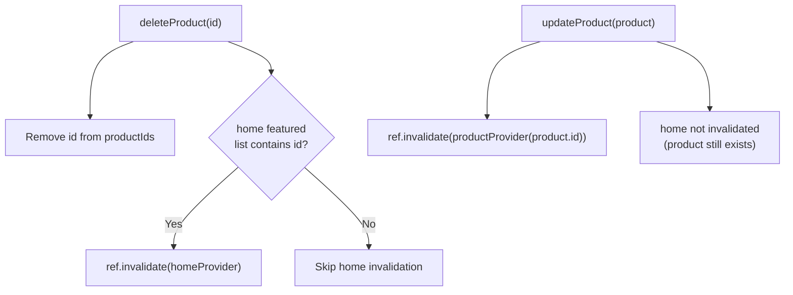

# CRUD Mutations & State Management

Building on the state management patterns from [Architecture and State Management Chapter > Advanced Patterns](../../07.architecture-and-state-management/docs/04.advanced_patterns.md), this section extends the application with full CRUD (Create, Read, Update, Delete) operations for products. It introduces `ref.listen` for reacting to state changes from outside a widget's build method and extends the `isMutating` pattern to cover create, update, and delete operations.

## Extending the Domain Layer for Mutations

Before adding new use cases, the domain layer needs new repository contracts and a new entity to represent the mutation lifecycle.

### New Repository Contracts

The `ProductRepository` interface is extended with four new methods:

```dart
// features/product/domain/repositories/product_repository.dart
abstract interface class ProductRepository {
  // ... existing methods

  Future<List<Product>> getMyProducts();
  Future<Product> createProduct(Product product);
  Future<Product> updateProduct(Product product);
  Future<void> deleteProduct({required String id});
}
```

### New Use Cases

Each operation gets its own use case class in `features/product/domain/usecases/`:

```dart
// get_my_products.dart: returns only the IDs, not full objects
class GetMyProductsUseCase {
  const GetMyProductsUseCase({required this.productRepository});
  final ProductRepository productRepository;

  Future<List<String>> execute() async {
    final products = await productRepository.getMyProducts();
    return products.map((e) => e.id).toList();
  }
}

// create_product.dart
class CreateProductUseCase {
  const CreateProductUseCase({required this.productRepository});
  final ProductRepository productRepository;

  Future<Product> execute(Product product) {
    return productRepository.createProduct(product);
  }
}

// update_product.dart
class UpdateProductUseCase {
  const UpdateProductUseCase({required this.productRepository});
  final ProductRepository productRepository;

  Future<Product> execute(Product product) {
    return productRepository.updateProduct(product);
  }
}

// delete_product.dart
class DeleteProductUseCase {
  const DeleteProductUseCase({required this.productRepository});
  final ProductRepository productRepository;

  Future<void> execute({required String id}) {
    return productRepository.deleteProduct(id: id);
  }
}
```

`GetMyProductsUseCase.execute()` returns only `List<String>` (IDs), not full `Product` objects. The presentation layer then resolves each ID through the existing `productProvider(id)` family provider. This avoids duplicating product data in a separate list and ensures product details always come from the single authoritative provider.

### The MyProductsSnapshot Entity

Mutations share state and need a way to track their lifecycle without discarding the current product list. A dedicated entity tracks both:

```dart
// features/my_products/domain/entities/my_products.dart
enum MyProductsMutationStatus { idle, mutating, success }

class MyProductsSnapshot {
  const MyProductsSnapshot({
    required this.productIds,
    this.mutationStatus = MyProductsMutationStatus.idle,
  });

  MyProductsSnapshot copyWith({
    List<String>? productIds,
    MyProductsMutationStatus? mutationStatus,
  }) {
    return MyProductsSnapshot(
      productIds: productIds ?? this.productIds,
      mutationStatus: mutationStatus ?? this.mutationStatus,
    );
  }

  final List<String> productIds;
  final MyProductsMutationStatus mutationStatus;

  bool get isMutating => mutationStatus == MyProductsMutationStatus.mutating;
  bool get isSuccess => mutationStatus == MyProductsMutationStatus.success;
}
```

`mutationStatus` is an enum with three values. The computed `isMutating` and `isSuccess` getters keep widget code readable by avoiding repeated enum comparisons.

## MyProductsNotifier: CRUD State Coordinator

`MyProductsNotifier` is an `AsyncNotifier` that loads the list of product IDs and exposes three mutation methods. All three methods follow the same lifecycle:

1. Guard against concurrent mutations with `if (snapshot.isMutating) return`.
2. Optimistically set state to `mutating` so the UI can show a loading overlay immediately.
3. Execute the use case.
4. On success, update state with `success` status and the updated product list.
5. On failure, roll back to `idle` and emit `AsyncError`.

### createProduct

```dart
Future<void> createProduct(Product product) async {
  final snapshot = state.value ?? await future;
  if (snapshot.isMutating) return;

  state = AsyncData(
    snapshot.copyWith(mutationStatus: MyProductsMutationStatus.mutating),
  );
  try {
    final useCase = ref.read(createProductUseCaseProvider);
    final createdProduct = await useCase.execute(product);

    state = AsyncData(
      snapshot.copyWith(
        mutationStatus: MyProductsMutationStatus.success,
        productIds: [...snapshot.productIds, createdProduct.id],
      ),
    );

    ref.invalidate(homeProvider); // Keep the home page fresh
  } catch (e, st) {
    state = AsyncData(snapshot.copyWith(mutationStatus: MyProductsMutationStatus.idle));
    state = AsyncError(e, st);
  }
}
```

After a successful create, the new product's ID is appended to the current list and `homeProvider` is invalidated because the home page may show the same product catalogue.

### updateProduct

```dart
Future<void> updateProduct(Product product) async {
  final snapshot = state.value ?? await future;
  if (snapshot.isMutating) return;

  state = AsyncData(
    snapshot.copyWith(mutationStatus: MyProductsMutationStatus.mutating),
  );
  try {
    final useCase = ref.read(updateProductUseCaseProvider);
    await useCase.execute(product);

    state = AsyncData(
      snapshot.copyWith(mutationStatus: MyProductsMutationStatus.success),
    );

    ref.invalidate(productProvider(product.id)); // Invalidate the specific cached product
  } catch (e, st) {
    state = AsyncData(snapshot.copyWith(mutationStatus: MyProductsMutationStatus.idle));
    state = AsyncError(e, st);
  }
}
```

After a successful update, `productProvider(product.id)` is invalidated so that any widget watching that specific product (the list tile, the detail page) gets the fresh data from the repository cache.

### deleteProduct

```dart
Future<void> deleteProduct({required String id}) async {
  final snapshot = state.value ?? await future;
  if (snapshot.isMutating) return;

  state = AsyncData(
    snapshot.copyWith(mutationStatus: MyProductsMutationStatus.mutating),
  );
  try {
    final deleteProduct = ref.read(deleteProductUseCaseProvider);
    await deleteProduct.execute(id: id);

    state = AsyncData(
      snapshot.copyWith(
        mutationStatus: MyProductsMutationStatus.success,
        productIds: snapshot.productIds.where((e) => e != id).toList(),
      ),
    );

    final homeSnapshot = ref.read(homeProvider).value;
    if (homeSnapshot?.featuredProductIds.contains(id) ?? false) {
      ref.invalidate(homeProvider); // Only invalidate home if it was showing this product
    }
  } catch (e, st) {
    state = AsyncData(snapshot.copyWith(mutationStatus: MyProductsMutationStatus.idle));
    state = AsyncError(e, st);
  }
}
```

After deletion, the ID is removed from the list via `.where((e) => e != id)`. The home page is only invalidated if it was actually featuring the deleted product, avoiding unnecessary network requests.

### The Double-State Error Pattern

Notice the two-line error handling:

```dart
state = AsyncData(snapshot.copyWith(mutationStatus: MyProductsMutationStatus.idle));
state = AsyncError(e, st);
```

Setting `AsyncData` first resets `isMutating` to `false`, which removes the loading overlay. Setting `AsyncError` immediately after broadcasts the error to any `ref.listen` listeners. If you set only `AsyncError`, the loading overlay would remain active (because `isMutating` would still be `true` in the last known `AsyncData` value).

## Reacting to State Changes with ref.listen

Widgets use `ref.watch` to rebuild the UI when state changes. But sometimes you need to trigger a one-time **side effect** in response to a state change (e.g., showing a snackbar, navigating away) rather than rebuilding the widget tree. `ref.listen` is designed for this.

`ref.listen` accepts a provider and a callback with `(previous, next)` parameters. It fires every time the provider state changes, but does **not** cause a rebuild:

```dart
@override
Widget build(BuildContext context) {
  ref.listen<AsyncValue<MyProductsSnapshot>>(myProductsProvider, (previous, next) {
    if (next.hasError) {
      AppSnackBar.showErrorSnackBar(context, message: next.error.toString());
      return;
    }

    if (next.value?.isSuccess ?? false) {
      final message = _isExistingProduct
          ? 'Product updated successfully'
          : 'Product created successfully';
      AppSnackBar.showSuccessSnackBar(context, message: message);
      Navigator.of(context).pop();
    }
  });

  // ... rest of build
}
```

This pattern keeps the widget's `build` method focused on describing the UI, while the listener handles navigation and notifications as reactions to state changes.

## Extending the Data Layer

The repository implementation in `MockProductRepository` now maps domain `Product` objects to JSON using the `fromDomain` factory and `toJson` methods added to `ProductModel` and `PriceModel`:

```dart
// ProductModel.fromDomain: converts domain entity -> data model for sending
factory ProductModel.fromDomain(Product product) {
  return ProductModel(
    id: product.id,
    name: product.name,
    description: product.description,
    price: PriceModel.fromDomain(product.price),
    imageUrl: product.imageUrl,
    creatorId: product.creatorId,
  );
}

// ProductModel.toJson: serialises to the API request format
Map<String, dynamic> toJson() {
  return {
    if (id.isNotEmpty) 'id': id, // Omit 'id' on create (server assigns it)
    'name': name,
    'description': description,
    'price': price.toJson(),
    'image_url': imageUrl,
  };
}
```

The `if (id.isNotEmpty) 'id': id` pattern uses Dart's collection-if syntax to conditionally include the `id` key. On create, the domain entity has an empty ID, so the key is omitted and the server assigns a new one. On update, the ID is present and the server uses it to find the record.

## Cross-Provider Cache Invalidation Strategy

The `deleteProduct` and `updateProduct` mutations demonstrate a targeted cache invalidation strategy:



- **Delete**: Only invalidates `homeProvider` if the deleted product was actually featured. Avoids a redundant network request when deleting a product the home page isn't showing.
- **Update**: Invalidates only the specific `productProvider(id)` family instance. The home page provider is not touched because the product still exists.
