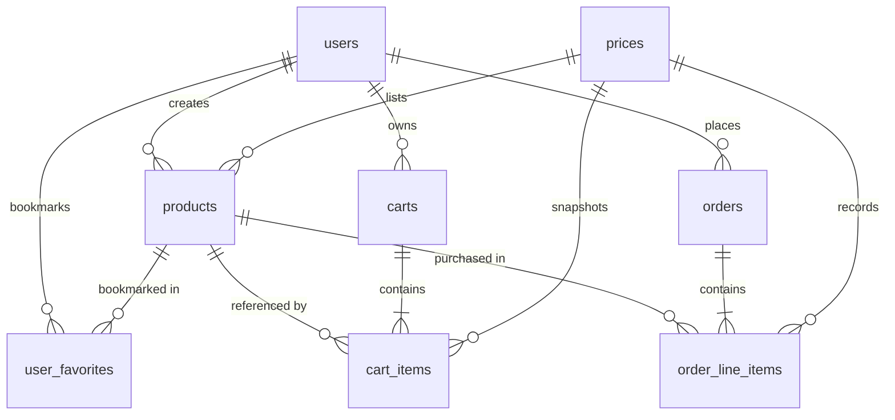

# Architecture & Design

This document explains the backend as a software design exercise. The goal is not to hide complexity behind a framework, but to make the important boundaries visible.

## 1. Design goals

MyStore has four primary goals:

1. **Teach REST fundamentals first.**
2. **Add authentication without rewriting the application.**
3. **Keep business logic independent from Express route definitions.**
4. **Use real database concepts such as transactions and migrations.**

The project is intentionally small, but its boundaries resemble a larger service.

### If you are new to this structure

You do **not** need to understand every folder before you can understand the application. Start with one request and ask four questions:

1. **Where does the URL enter the application?** -> `routes/`
2. **Where is the HTTP request turned into an application call?** -> `controllers/`
3. **Where is the application decision made?** -> `services/`
4. **Where does the data come from?** -> `models/` -> PostgreSQL

That is the core of this project. Authentication, transactions, migrations, and API versioning are built around that basic flow.

## Project structure

The repository separates HTTP handling, business rules, and database access so each concern can be studied independently.

```text
mystore-backend/
├── docs/                    # SETUP, LEARNING_GUIDE, ARCHITECTURE, API
├── src/
│   ├── config/              environment configuration
│   ├── controllers/         HTTP request/response handling
│   ├── db/                  database connection and migrations
│   ├── middleware/          authentication, errors, async handling
│   ├── models/              database access and data mapping
│   ├── routes/              endpoint registration
│   ├── services/            business rules and use cases
│   ├── utils/               shared authentication/error helpers
│   ├── app.js               application composition
│   └── server.js            database connection and HTTP startup
├── Dockerfile
├── package.json
└── .env.example
```

A useful rule while reading the code is: **do not put database queries in controllers, and do not put HTTP concerns in models.**

## 2. Architecture at a glance

The easiest way to think about the backend is: **a request comes in, the backend figures out who the user is, applies the business rules, talks to database, and sends the result back.**

The diagram below shows that whole idea in one place:

```text
Client
  │
  ├── /api/v1/* ── fixed demo identity ──┐
  │                                      │
  └── /api/v2/* ── JWT authentication ───┤
                                         ▼
                                      Routes
                                         │
                                         ▼
                                    Controllers
                                         │
                                         ▼
                                     Services
                                         │
                                         ▼
                                      Models
                                         │
                                         ▼
                                     PostgreSQL

v2 authentication:

Google Sign-In
     │
     ▼
POST /api/v2/auth/google
     │
     ├── verify Google ID token
     ├── find/create local user
     └── issue application JWT
              │
              ▼
Authorization: Bearer <JWT>
              │
              ▼
       protected /api/v2/* routes
```

### In simple terms

There are two API versions, but there is **not** a separate application for each version.

- **v1** skips real login and uses one fixed demo user. This makes it easy to learn products, carts, favorites, and orders first.
- **v2** uses a real authentication flow. The client signs in with Google, the backend verifies the Google ID token, and then the backend gives the client its own JWT.
- After authentication, both versions reach the **same controllers, services, models, and database**.

So the version difference is mainly **how the request gets authenticated**, not how products, carts, or orders are implemented.

The important idea is that **v1 and v2 share controllers, services, models, and database access**. The version-specific authentication middleware is selected when the routes are registered.

## 3. Layered architecture

Each layer has one main job. You can read the diagram from top to bottom:

- **Routes:** decides which endpoint and middleware should run.
- **Controllers:** receives the HTTP request and calls the application logic.
- **Services:** contains the actual business rules.
- **Models:** data mapping and CRUD operations with database (PostgreSQL).

A useful mental model is: **Routes decide where to go -> Controllers translate the request -> Services decide what should happen -> Models read/write data.**

```text
                    ┌──────────────────────┐
                    │       Routes         │
                    │   URL + middleware   │
                    └──────────┬───────────┘
                               │
                    ┌──────────▼───────────┐
                    │    Controllers       │
                    │ HTTP <-> application │
                    └──────────┬───────────┘
                               │
                    ┌──────────▼───────────┐
                    │      Services        │
                    │  business/use cases  │
                    └──────────┬───────────┘
                               │
                    ┌──────────▼───────────┐
                    │       Models         │
                    │  SQL + data mapping  │
                    └──────────┬───────────┘
                               │
                    ┌──────────▼───────────┐
                    │       Database       │
                    └──────────────────────┘
```

### Routes

Routes answer: **which middleware and controller handle this URL?**

For example, the same product router can be created with different authentication middleware:

```js
app.use("/api/v1/products", productRoutes(dummyAuth));
app.use("/api/v2/products", productRoutes(jwtAuth));
```

The route layer therefore owns the version-specific difference. In simple terms, the same product related code is reused twice. The only thing that changes here is the question "how do I identify the user?"

### Controllers

Controllers translate HTTP into application calls and application results back into HTTP responses.

They should stay thin. For example, `createProduct` extracts request fields, supplies `req.user_id`, calls the service, and chooses `201 Created`. It should not contain SQL or ownership rules.

### Services

Services contain business rules such as:

- validating required product fields;
- checking that a user owns a product before updating it;
- checking cart ownership;
- converting a cart into an order;
- verifying a Google token before creating a session.

This is the most reusable layer when multiple transports or API versions share the same business behavior. If the rule is about what the application should allow or do, it usually belongs here.

### Models

Models own database access and map database rows into API-facing objects.

The project uses `pg` directly instead of an ORM so SQL remains visible to learners. Queries use parameter placeholders such as `$1`, `$2`, etc. This keeps values separate from SQL text and avoids building SQL by string concatenation.

## Request lifecycle

A typical protected request follows this path:

```text
HTTP request
   │
   ▼
Express route
   │
   ▼
Authentication middleware
   │  sets req.user_id
   ▼
Controller
   │  translates HTTP -> use-case arguments
   ▼
Service
   │  validates rules / ownership / workflow
   ▼
Model
   │  executes parameterized SQL
   ▼
Database
   │
   ▼
Model mapping
   │
   ▼
Controller response
   │
   ▼
{ "data": ... }
```

### In simple terms

Imagine the client sends `GET /api/{version}/products/mine`.

1. **Express route** matches the URL.
2. **Authentication middleware** checks the version and calls the appropriate authentication middleware.
3. **Controller** reads the request and calls the product service.
4. **Service** decides what the user is allowed to see.
5. **Model** runs the SQL query using that user ID.
6. **Database** returns the rows.
7. The result travels back through the model, service, and controller.
8. The controller sends JSON such as `{ "data": [...] }` to the client.

This is why the code is split into layers: when you want to understand **what the API does**, you can follow one request through a small number of files instead of looking for everything in one controller.

## 4. API versioning without duplication

The two versions deliberately share the same implementation:

```text
               Client
                 │
    ┌────────────┴────────────┐
    │                         │
/api/v1/*                 /api/v2/*
    │                         │
    ▼                         ▼
dummyAuth                  jwtAuth
    │                         │
    └────────────┬────────────┘
                 │
                 ▼
          Shared Routes
                 │
                 ▼
        Shared Controllers
                 │
                 ▼
          Shared Services
                 │
                 ▼
           Shared Models
                 │
                 ▼
              Database
```

### Why this matters

Without this structure, you could end up with one product implementation for v1 and another almost-identical implementation for v2. A bug fixed in one version could then remain in the other.

Here, the authentication middleware is the replaceable part. Once it sets `req.user_id`, the rest of the application does not need to care how that ID was obtained.

The contract between authentication middleware and the application is intentionally tiny:

```js
req.user_id = authenticatedUserId;
```

Everything downstream can work with an authenticated user ID without knowing whether it came from v1's demo identity or v2's JWT.

## 5. Authentication

### The two tokens are not the same thing

- The Google ID token answers: **"Did Google authenticate this person?"**
- The MyStore JWT answers: **"Which MyStore user is making this API request?"**

The Google ID token is therefore used during login, while the MyStore JWT is used on later protected API requests.

The Google ID token and application JWT have different responsibilities:

| Token           | Purpose                            | Accepted by protected API routes? |
| --------------- | ---------------------------------- | --------------------------------- |
| Google ID token | Prove identity during Google login | No                                |
| Application JWT | Authenticate requests to MyStore   | Yes                               |

The application JWT currently contains the local user ID and expires after 7 days.

## 6. Database design

The database is relational and models a complete e-commerce lifecycle: user management, product creation, catalog browsing, shopping carts, price snapshots, and order placement.

### Entity Relationships at a Glance

All primary keys use UUIDs (`gen_random_uuid()`). The diagram below outlines how the 8 tables connect:

```text
                                ┌──────────────┐
                                │     users    │
                                └──────┬───────┘
            ┌──────────────┬───────────┴─────────┬─────────────────────┐
            │ (creator)    │ (owner)             │ (owner)             │ (user)
            ▼              ▼                     |                     |
      ┌──────────┐    ┌─────────┐           ┌─────────┐       ┌────────────────┐
      │ products │    │  carts  │           │ orders  │       │ user_favorites │
      └─┬──┬──┬──┘    └────┬────┘           └────┬────┘       └────────┬───────┘
        │  │  │            │ (1:N)               │ (1:N)               │
        │  │  │            ▼                     |                     │
        │  │  │     ┌────────────┐               |                     │
        │  │  ├────>│ cart_items │               │                     |
        │  │  │     └──────┬─────┘               │                     |
        │  │  │            │ (unit_price)        │                     |
        │  │  |            |             ┌──────────────────┐          |
        │  |  └─────────────────────────>│ order_line_items │          |
        |  |               |             └────────┬─────────┘          |
        │  │               |                      |  (purchase_price)  │
        │  │               ▼                      ▼                    │
        │  |       ┌───────────────────────────────────┐               │
        │  └──────>│               prices              │               │
        │          └───────────────────────────────────┘               │
        └─────────>────────────────────────────────────────>───────────┘
```



### Main Tables

| Table              | Purpose                             |
| ------------------ | ----------------------------------- |
| `users`            | User accounts                       |
| `products`         | Products created by users           |
| `prices`           | Product price records and snapshots |
| `user_favorites`   | Products bookmarked by users        |
| `carts`            | User shopping carts                 |
| `cart_items`       | Products and quantities in a cart   |
| `orders`           | Completed purchases                 |
| `order_line_items` | Products purchased in an order      |

### Price Snapshots: Preserving History

**Why store the price in multiple places?**

If a product's price changes tomorrow from $10 to $15, past orders must still record that the customer paid $10. Similarly, an active cart retains the price agreed upon when added.

The `prices` table acts as an immutable price ledger across three stages:

```text
1. Catalog Creation:
   Product created ─────────────> inserts prices row (price_id)

2. Added to Cart:
   Item added to cart ──────────> copies product's current price into new prices row (unit_price_id)

3. Order Checkout:
   Cart converted to order ─────> copies unit price into new prices row (purchase_price_id)
```

**In simple terms:** If a cookie costs $100 today and increases to $150 next month:

- Active catalog queries read `$150`.
- Past orders still point to their snapshot row containing `$100`.

### Transactions

- A transaction means: **either all related database changes succeed, or none of them are kept.** For example, creating an order involves creating the order, copying its line items, and completing the cart. These steps belong together. Multi-step operations use PostgreSQL transactions. Examples include:
  - creating a product and its price;
  - updating a product and its price;
  - deleting a product and its price;
  - adding/updating/removing cart items;
  - creating an order and its line items.

The pattern is:

```text
BEGIN
  step 1
  step 2
  step 3
COMMIT
```

If a step fails:

```text
BEGIN
  step 1
  step 2  <- failure
ROLLBACK
```

This prevents partially completed multi-table writes.

## 7. Migrations

A migration is simply a **recorded database change**. Instead of manually changing your database and hoping every developer makes the same change, the repository keeps SQL files that describe the schema changes in order.

For example:

```text
001_init.sql          -> create the tables
002_seed_users.sql    -> add demo users
003_seed_products.sql -> add sample products
```

The migration runner remembers which files have already been applied and only runs the pending ones. The migration runner is intentionally lightweight.

At startup of `npm run db:migrate` it

1. creates `schema_migrations` if needed;
2. reads `.sql` files from `src/db/migrations`;
3. sorts them by filename;
4. skips migrations already recorded in `schema_migrations`;
5. runs each pending migration in its own transaction;
6. records the migration only after its SQL succeeds.

Do not edit an already-applied migration in a shared environment. Add a new migration instead.

## 8. Error handling

Errors follow the same idea as successful responses: the controller is responsible for turning application results into HTTP responses. In simple terms, a service can say **"this product does not belong to this user"**, and the controller/middleware turns that into the appropriate HTTP status and JSON error response.

Controllers throw `ApiError` for expected application failures. `asyncHandler` forwards rejected promises to Express's error middleware.

```text
controller/service
       │
       ├── ApiError(400, ...)
       ├── ApiError(403, ...)
       └── ApiError(404, ...)
                 │
                 ▼
            errorHandler
                 │
                 ▼
        { "message": "..." }
```

Unexpected errors become HTTP 500 responses.

## 9. Ownership model

Ownership answers a simple question: **"Is this resource owned by the user making the request?"** For example, a user can update or delete their own product, but should not be able to update another user's product just because they know its ID. The user ID comes from authentication and is passed down to the service/model instead of being trusted from arbitrary client input.

The authenticated user ID is passed explicitly into services:

```js
updateProduct(id, userId, data);
```

The service first loads the resource and checks ownership:

```text
resource exists?
       │
       ├── no -> 404
       │
       ▼
owner matches authenticated user?
       │
       ├── no -> 403
       │
       ▼
perform operation
```

## 10. Public vs protected endpoints

Not every endpoint needs a logged-in user. The route definition makes this boundary visible by deciding whether authentication middleware is attached.

The catalog endpoints are public because a store needs to be browsable before a user signs in:

- `GET /products/hero`
- `GET /products/featured`
- `POST /products/bulk`

User-specific operations are protected:

- `GET /products/mine`
- product creation/update/deletion;
- favorites;
- cart;
- orders.

The auth endpoint itself is public because it is the entry point into authentication:

- `POST /api/v2/auth/google`

## 11. Limitations

This repository is intentionally scoped for learning. Some production features and safeguards are deliberately simplified or omitted.

### Authentication & Authorization

- The project has no concept of roles and permissions. All users are assumed to be regular users.
- The project allows users to access protected endpoints without authentication if they use v1 version, they will be able to use them as a dummy user.
- The important boundary is that the client never chooses the authenticated user by sending an arbitrary user ID. Backend injects dummy user id in `req.user_id` if using v1 or rely on authentication middleware to extract and populate `req.user_id` if using v2. The services use that identity when checking ownership.
- The project also deliberately does not implement a real payment processor, rate limiting, refresh-token rotation, audit logging, or advanced observability.

### Payments & Orders

- No real payment provider is integrated. Payment IDs are stored as application data.
- Orders do not implement inventory reservation or payment atomicity.
- The cart currently permits an order with zero line items.
- Mixed currencies are represented as `invalid` in cart totals rather than being converted or rejected.

### Production Safeguards

- No rate limiting is implemented.
- No request-schema validation framework is used.
- JWT refresh-token rotation is not implemented.
- No structured logging, metrics, or distributed tracing stack is included.
